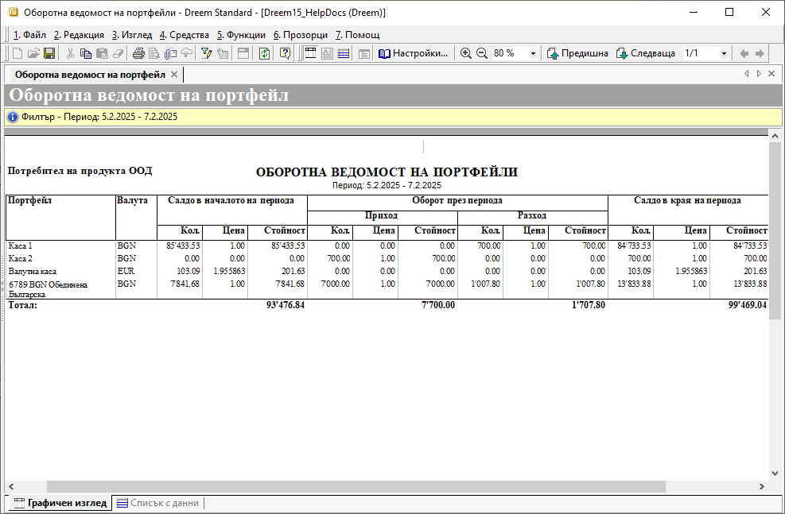

```{only} html
[Нагоре](000-index)
```

# **Оборотна ведомост на портфейли**

Справката **Оборотна ведомост на портфейли** представя синтезирана информация за паричните потоци по банкови сметки и каси. Данните в справката включват портфейлите, в които има отразени движения и/или наличности за избран интервал от време.  

Справката се намира в **Търговска система || Оборотна ведомост на портфейли**.

- **От дата** и **До дата** - чрез полетата се определя период за справката;  

- **Валута** - от полето може да се избере конкретна валута на справката;  
Ако полето остане празно, системата извежда данните по избраните портфейли за всички валути.  

- **Портфейл** - в това поле има възможност да се избере определена каса и/или банкова сметка;  
Ако полето остане празно, системата представя данни за всички сметки и каси.  

{ class=align-center }

Справката дава обобщена информация за парична наличност в началото и в края на избрания период, както и за приходите и разходите през периода за всяка една банкова сметка и каса.

{ class=align-center w=15cm }
___  
## Свързани статии

- [Оборотна ведомост на портфейли](https://www.unicontsoft.com/cms/node/161)