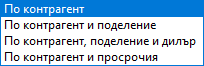
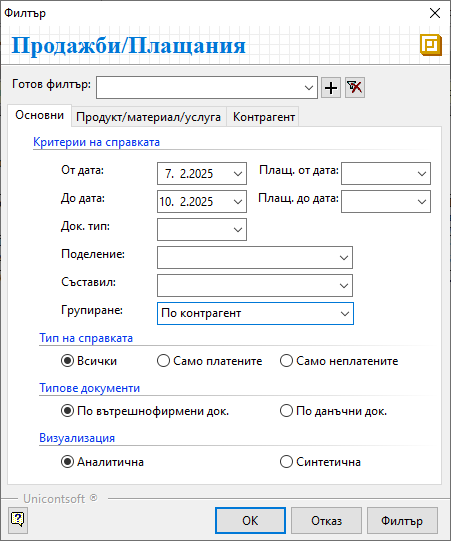
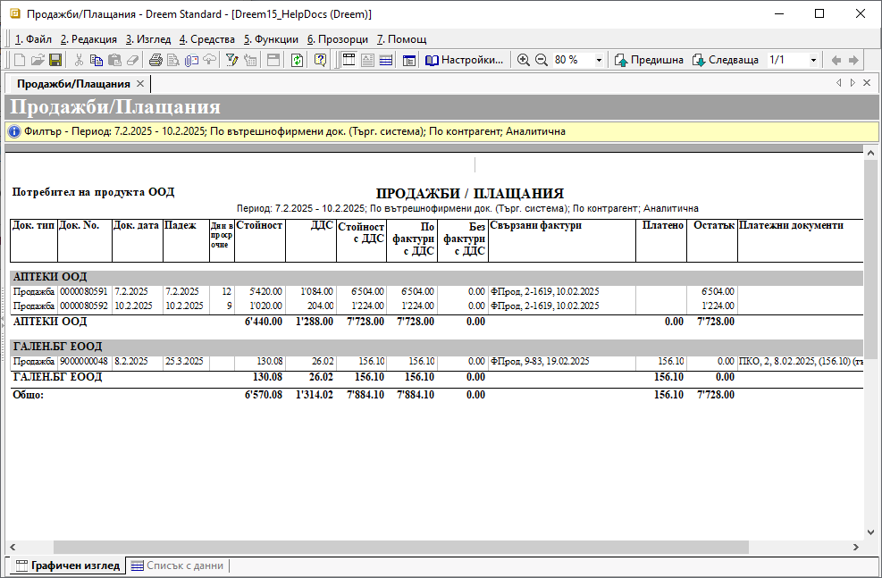
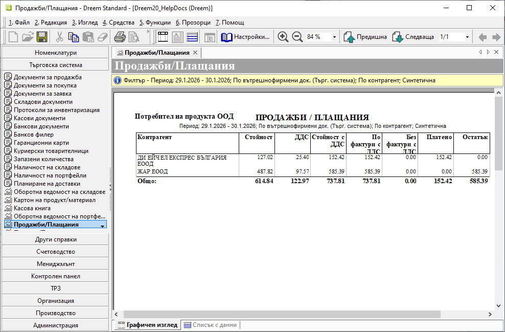

```{only} html
[Нагоре](000-index)
```

# **Продажби/Плащания**

Справката е достъпна от **Търговска система » Продажби/Плащания**.  
Проследява направени плащания, неплатени остатъци, падежи и просрочия по вътрешнофирмени и данъчни документи за продажба.  

Системата представя данните в различен формат спрямо избраната визуализация. Могат да бъдат обобщени по контрагенти или детайлни с хронологично цитирани продажби и свързани платежни документи.   

Филтър формата съдържа следните опции за избор на критерии:  

В раздел **Основни**:  

 - **От дата** и **До дата** - Чрез полетата се указва времеви обхват на справката.  
 Участват продажбите с дата на документа, попадаща в избрания период.  

 - **Плащ. от дата** и **Плащ. до дата** - Избор на период за филтриране спрямо регистрираните платежни документи.  
 Справката включва единствено продажбите с плащания, регистрирани в избрания период.  

 - **Док. тип** - Възможност за ограничаване на справката за избрани типове документи - един или няколко.   
 Списъкът в полето варира спрямо маркираната опция за **Типове документи** - *По вътрешнофирмени док.* или *По данъчни док.*.  

 - **Обект** - В полето могат да бъдат избрани един или няколко обекта.  
 Справката обхваща единствено документи, издадени с тези обекти.  

 - **Съставил** - Опция за филтриране по издател на документа.  
 От списъка със служители могат да бъдат избрани една или няколко персони.   
 
 - **Групиране** - Указва се вид за групиране на данните в справката.  
 Системата променя шаблона на справката спрямо избраната групировка. Добавя допълнителна информация за обект, търговец и детайли за просрочени вземания.  

    { class=align-center }

 - **Тип на справката**:  
    - **Всички** - При тип се генерира списък с платени и с неплатени документи.  
    - **Само платените** - Генерира се списък единствено с документи без остатък за плащане.  
    - **Само неплатените** - Справката обхваща единствено документи с остатък за плащане.  

 { class=align-center }
 
 - **Типове документи**:  
    - **По вътрешнофирмени док.** - При тази опция спавката показва всички вътрешнофирмени документи за продажба, отговарящи на останалите критерии във филтъра.  
    Водещите полета в справката с *Док. тип*, *Док. No*, *Док. дата*, *Падеж* се отнасят до тези документи.  
    При наличие на издадени към тях данъчни документи, се обзавежда колона *Свързани фактури*.  

    > Този вариант изключа от справката фактури и кредитни/дебитни известия, за които липсва свързан вътрешнофирмен документ - **Продажба**, **КДПрод**/**ДДПрод**.   

    - **По данъчни док.** - При тази опция справката включва единствено данъчните документи. Списъкът показва издадените фактури, кредитни/дебитни известия и регистрираните към тях плащания.  

    > Този вариант изключа от справката вътрешнофирмените документи, за които няма издаден данъчен документ.  

- **Визуализация**:  
    - **Аналитична** - Генерира се аналитична справка по документи за продажба и свързани с тях платежни документи.  

    { class=align-center w=15cm }

    - **Синтетична** - При тази визуализация справката е обобщена и не показва отделните документи за продажби.  

    { class=align-center w=15cm }

В раздел **Продукт/материал/услуга**:  
Разделът включва критерии за справката, свързани с *Продукти и материали*, *Типове продукти*, *Дименсии* и *Разходен център*.    

В раздел **Контрагент**:  
От формата в този раздел могат да бъдат приложени филтри по *Контрагент*, *Дименсия*, *Тип*, *Търговец*, *Обект*.    
