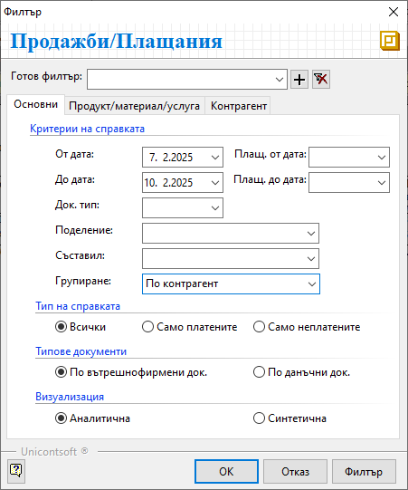
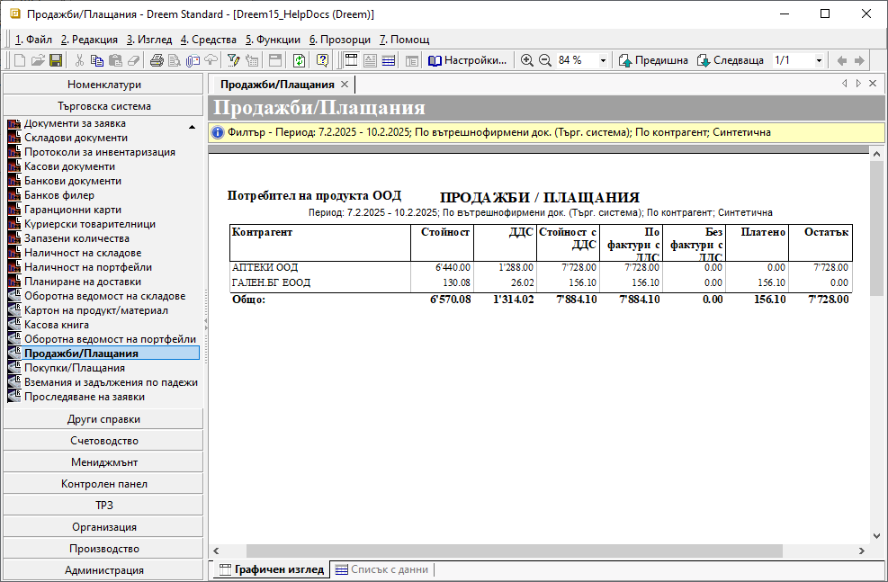

```{only} html
[Нагоре](000-index)
```

# Продажби/Плащания

Справката дава информация за направени плащания и остатъци по вътрешнофирмени и данъчни документи за продажба, падеж и брой на дните в просрочие.  
Системата представя данните според избраната визуализация - обобщено по контрагенти или детайлно с хронологично цитирани продажби и свързани платежни документи.  


Справката е достъпна в **Търговска система || Продажби/Плащания**.  

1) Раздел **Основни**:  

 - **От дата** и **До дата** - чрез полетата се определя период за справката;  
 Справката показва продажби с дата на документа, попадаща в този период от време.  

 - **Плащ. от дата** и **Плащ. до дата** - чрез тези полета се настройва филтър спрямо регистрираните платежни документи през избрания период;  
 В справката участват единствено продажбите, към които има регистрирани плащания за избрания период.  

 - **Док. тип** - полето дава възможност за филтриране на справката по конкретен тип документ;  
 Падащото меню в полето се обзавежда според избраната в **Типове документи** опция (*По вътрешнофирмени док.* или *По данъчни док.*).  

 - **Поделение** - реквизит за избор на едно или няколко поделения;  
 Справката се ограничава до документи, издадени от избраните поделения.  

 - **Съставил** - поле за избор на една или няколко персони;  
 Системата показва в справката единствено документите, съставени от избраните служители.  
 
 - **Групиране** - от падащия списък в полето се избира вид за групиране на справката;  
 Спрямо избрания вид групировка системата променя шаблона на справката. Добавя допълнителна информация за поделение, дилър и детайли за просрочени вземания.  

    { class=align-center }

 - **Тип на справката**:  
    - **Всички** - при избор на този тип системата извежда списък с платени и с неплатени документи;  
    - **Само платените** - при този тип  справка системата извежда списък единствено с документите без остатъци за плащане;  
    - **Само неплатените** - при този тип системата показва единствено документи, по които има остатък за плащане;  

 { class=align-center }
 
 - **Типове документи**:  
    - **По вътрешнофирмени док.** - с избора на тази опция системата показва списък с всички вътрешнофирмени документи за продажба, отговарящи на избраните критерии във филтъра;  
    Водещите полета в справката с *Док. тип*, Док. No*, *Док. дата*, *Падеж* се отнасят до тези документи.  
    При наличие на издадени към тях данъчни документи, се обзавежда колона *Свързани фактури*.  

    > При този вариант на справката няма да се визуализират фактури и кредитни/дебитни известия, за които липсва свързан вътрешнофирмен документ - **Продажба**, **КДПрод** или **ДДПрод**.   

    - **По данъчни док.** - при избора на тази опция водещите за справката са данъчните документи;  
    Системата показва списък с издадените фактури и кредитни/дебитни известия и регистрираните по тях плащания. 

    > При този вариант в справката няма да участват вътрешнофирмените документи, за които няма издаден данъчен документ.  

- **Визуализация**:  
    - **Аналитична** - при тази визуализация системата генерира справката с аналитичност по документи за продажба и свързани с тях платежни документи;  

    { class=align-center w=15cm }

    - **Синтетична** - при тази визуализация справката е обобщена и системата не показва отделните документи за продажби;  

    { class=align-center w=15cm }

2) Раздел **Продукт/материал/услуга** - от този раздел са достъпни критерии за справката *Продукти и материали*, *Типове продукти*, *Дименсии* и *Разходен център*;  

3) Раздел **Контрагент** - в този раздел на филтър формата има възможност за избор на един или няколко клиента по поделение, дилър и други;  

___  
## Свързани статии

- [Продажби/Плащания](https://www.unicontsoft.com/cms/node/202)