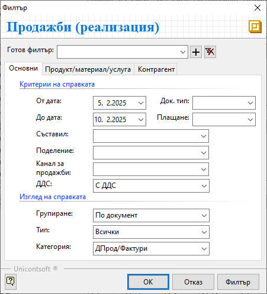
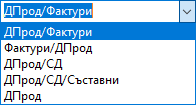
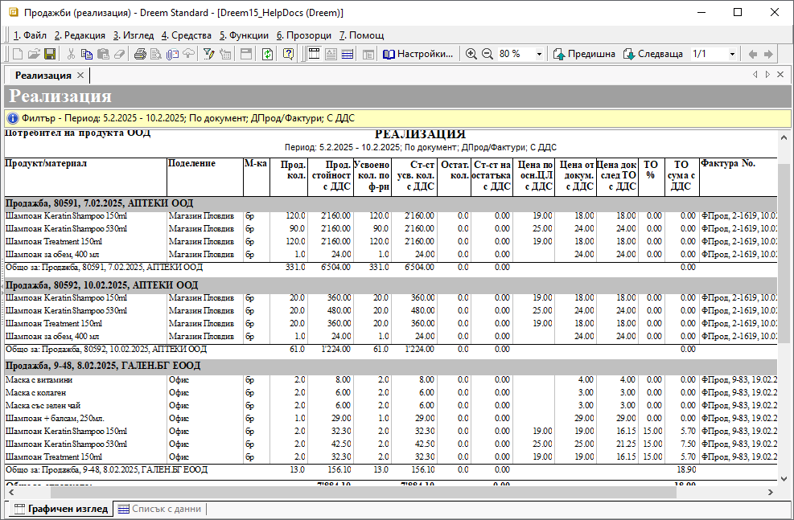

```{only} html
[Нагоре](000-index)
```

# **Продажби (реализация)**

Справката е достъпна в **Други справки » Продажби (реализация)**.  
Тя съпоставя стойностите от продажбите и свързаните им документи. Проследява се в каква степен количествата участващи продукти в продажбата са усвоени със складови и данъчни документи.  

В раздел **Основни**:  
- **От дата** и **До дата** - Чрез полетата се указва времеви обхват на справката.  
Участват продажбите с дата на документа, попадаща в избрания период.  
- **Док. тип** - Възможност за ограничаване на справката за избрани типове документи - един или няколко.   
- **Плащане** - Опцията позволява филтриране на продажбите за избрани типове плащания - един или няколко.  
- **Съставил** - Опция за филтриране по издател на документа.  
От списъка със служители могат да бъдат избрани една или няколко персони.   
- **Обект** - В полето могат да бъдат избрани един или няколко обекта.  
Справката обхваща единствено документи, издадени с тези обекти.  
- **Канал за продажби** - Чрез опцията се прилага филтър с един или няколко канала, за които са регистрирани продажбите.  
- **ДДС** - Указва визуализация на стойностите *С ДДС* или *Без ДДС*.  
Полето е активно при определени шаблони.  

{ class=align-center } 

- **Групиране**:  
     - **По документ** - при този вариант справката е структурирана по документи със списък на продуктите, които съдържат.   
     - **По продукт** - при тази групировка справката е организирана по продукти, представяйки за всеки един всички продажби, в които участва;  
     - **По контрагент** - при този вариант водещ критерий е **Контрагент**;  
     В справката са включени всички продадени продукти, структурирани по клиенти и съответните документи.

    { class=align-center } 

- **Тип на справката** - изборът на опция в този реквизит е пряко свързан с избора на **Категория на справката**;  
    - **Усвоени** - системата сравнява количества по свързани документи за избраните типове в **Категория на справката**, като се визуализират само напълно усвоени продукти. Това са продуктите, които нямат остатъчна наличност за фактуриране или изписване от склад.  
    - **Неусвоени** - в справката се визуализират единствено продукти, за които има остатъчни количества - неизписани от склад или нефактурирани продажби;  

    { class=align-center } 

- **Категория на справката** - от избора на категория на справката зависи между кои документи ще се сравняват усвоени количества;  
В първите два случая се сравняват продадените с фактурираните количества и обратното, а в следващите – продадените с изписаните от склада количества.

    { class=align-center } 

В раздел **Продукт/материал/услуга**:  
От този раздел са достъпни критерии за справката, свързани с *Продукти и материали*, *Типове продукти*, *Дименсии* и *Разходен център*.  

В раздел **Контрагент**:  
Във филтър формата  могат да бъдат приложени критерии, свързани с един или няколко клиента - обект, търговец и други.  

{ class=align-center w=15cm } 

