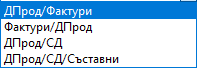
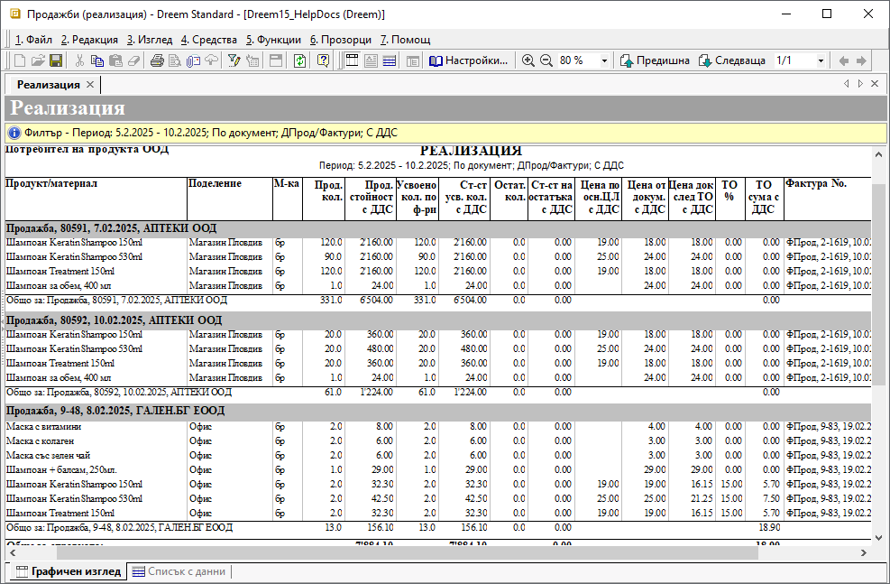

```{only} html
[Нагоре](000-index)
```

# **Продажби (реализация)**

Тази справка сравнява количествата и стойностите на продукти за определен период от време по документи, свързани с една продажба – складови документи, документ за продажба и фактура. Чрез тази справка лесно може да се провери дали всичко от дадена продажба е фактурирано и изписано от склада, дали има материали, които са занесени на даден клиент, но не са фактурирани и т.н.

Справката се намира в **Други справки || Продажби (реализация)**.  

1) Раздел **Основни**:  

Справката може да се филтрира в секция *Критерии на справката* чрез стандартните реквизити - период, тип на документа, тип на плащането, съставил документа, поделение, канал за продажби и опцията *С ДДС/Без ДДС*. 

 { class=align-center } 

- **Групиране**:  
     - **По документ** - при този вариант справката е структурирана по документи със списък на продуктите, които съдържат.   
     - **По продукт** - при тази групировка справката е организирана по продукти, представяйки за всеки един всички продажби, в които участва;  
     - **По контрагент** - при този вариант водещ критерий е **Контрагент**;  
     В справката са включени всички продадени продукти, структурирани по клиенти и съответните документи.

    { class=align-center } 

- **Тип на справката** - изборът на опция в този реквизит е пряко свързан с избора на **Категория на справката**;  
    - **Усвоени** - системата сравнява количества по свързани документи за избраните типове в **Категория на справката**, като се визуализират само напълно усвоени продукти. Това са продуктите, които нямат остатъчна наличност за фактуриране или изписване от склад.  
    - **Неусвоени** - в справката се визуализират единствено продукти, за които има остатъчни количества - неизписани от склад или нефактурирани продажби;  

    { class=align-center } 

- **Категория на справката** - от избора на категория на справката зависи между кои документи ще се сравняват усвоени количества;  
В първите два случая се сравняват продадените с фактурираните количества и обратното, а в следващите – продадените с изписаните от склада количества.

    { class=align-center } 

2) Раздел **Продукт/материал/услуга** - от този раздел са достъпни критерии за справката *Продукти и материали*, *Типове продукти*, *Дименсии* и *Разходен център*;  

3) Раздел **Контрагент** - в този раздел на филтър формата има възможност за избор на един или няколко клиента по поделение, дилър и други;  

{ class=align-center w=15cm } 

___  
## Свързани статии

[Продажби (реализация)](https://www.unicontsoft.com/cms/node/213)