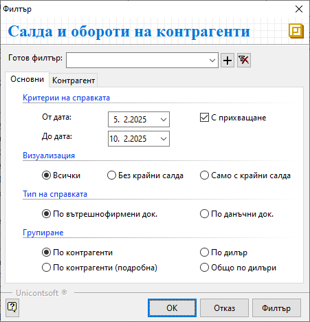

```{only} html
[Нагоре](000-index)
```

# **Салда и обороти**

Справка **Салда и обороти на контрагенти** е достъпна от меню **Други справки**.  
Тя показва реализираните обороти по контрагенти с документи за покупка и продажба. Представена е информация за регистрирани плащания, вземания и задължения в началото и в края на разглеждания период.  

Филтър формата съдържа следните опции за избор на критерии:  

{ class=align-center }

В раздел **Основни**  

- **Критерии на справката**:  
   - **От дата** и **До дата** - От полетата се указва времеви обхват на справката.  
   - **С прихващане** - При активиране на опцията системата съпоставя и прихваща вземания и задължения. В справката тези стойности са изключени от крайното салдо.    

- **Визуализация**:  
   - *Всички* - Генерираната справка включва всички документи от избрания период.  
   - *Без крайни салда* – Показва справка единствено за контрагенти без задължения или вземания към края на периода.  
   - *Само с крайни салда* – Показва информация единствено за контрагенти с неплатени вземания или задължения за периода.  

- **Тип на справката**:  
   - *По вътрешнофирмени док.* - Справката разглежда единствено вътрешнофирмените документи от **Търговска система**.    
   - *По данъчни док.* - Генерираната справка включва данни единствено от данъчни документи (фактури, кредитни и дебитни известия).  

- **Групиране** – От избора на групировка зависи колко детайлна информация ще представи справката.  
   - *По контрагенти* - Представените данните включват вземания и задължения по контрагенти в началото и в края на периода, стойност на покупки, продажби и плащания, регистрирани през периода.    
   - *По контрагенти (подробна)* - Справката представя разширена информация за плащанията в периода – разплатена сума по покупки и по продажби, както и каква част от плащанията не са свързани с други документи.    
   - *По търговец* - Групировката на данните за всеки контрагент са разпределени по търговец.  
   Добавена е информация за процент на събираемост на вземания и задължения.   
   - *Общо по търговци* - При тази групировка справката показва за всеки търговец обобщените суми на вземания и задължения. Не се включва аналитичност по контрагенти.    

В раздел **Контрагент**:  
От този раздел на формата могат да бъдат избрани критерии за филтър на справката, свързани с *Контрагент*, *Дименсии*, *Тип*, *Търговец*.  

След генериране на справката на екран може да бъде отворен **Картон на контрагент** с детайлна информация по документи.  
Опцията е достъпна от изглед **Списък с данни**. Справката се отваря чрез двоен клик върху реда с избран контрагент или с десен клик и избор на **Картон на контрагент**.  

