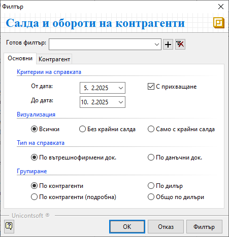

```{only} html
[Нагоре](000-index)
```

# Салда и обороти на контрагенти

Справката показва оборотите по документи за покупка и продажба, реализирани по контрагенти, за определен период от време. Представена е информация за вземания и задължения в началото и в края на разглеждания период. Справката включва и регистрираните чрез касови и банкови документи плащания.  

Тази справка се намира в **Други справки || Салда и обороти на контрагенти**.

1) В раздел **Основни** са достъпни следните реквизити за филтриране на данни:

 - **Критерии на справката**:  
    - **От дата** и **До дата** - в полетата се определя периода на справката;  
    - **С прихващане** - при активиране на тази опция, в справката системата прихваща вземания и задължения, така че тези суми са изключени от крайното салдо;  

 - **Визуализация**:  
    - *Всички* - генерираната справка включва информация за всички документи от периода;  
    - *Без крайни салда* – справката включва информация единствено за контрагенти, за които няма задължения или вземания към края на периода;  
    - *Само с крайни салда* – системата филтрира информация единствено за контрагенти с неплатени вземания и задължения;  

 - **Тип на справката**:  
    - *По вътрешнофирмени док.* - справката разглежда единствено вътрешнофирмените документи от **Търговска система**;    
    - *По данъчни док.* - генерираната справка включва само данни от данъчните документи (фактури, кредитни и дебитни известия);  

 - **Групиране** – от избора на групировка зависи колко детайлна информация ще представи справката;  
    - *По контрагенти* - представените данните включват вземанията и задълженията по контрагенти в началото и в края на периода, стойност на покупки, продажби и плащания, регистрирани през периода;    
    - *По контрагенти (подробна)* - при тази групировка справката представя разширена информация за плащанията в периода – каква сума е по покупки и продажби, каква част от плащанията не са свързани с други документи;    
    - *По дилър* - данните за всеки контрагент са разпределени по дилър, като е добавена информация за процент на събираемост на вземания и задължения;   
    - *Общо по дилъри* -  тази групировка дава обобщени суми с вземания и задължения за дилър без аналитичност по контрагенти;    

2) В раздел **Контрагент** на формата може да бъде избран един или няколко контрагента за филтър на справката.

{ class=align-center }

След показване на справката на екран може да бъде отворен и **Картон на контрагент** с детайлна информация по документи.  
Това става от изглед **Списък с данни** - върху реда с избран контрагент чрез двоен клик на мишката или чрез десен бутон се избира **Картон на контрагент**.

___  
## Свързани статии
- [Салда и обороти на контрагенти](https://www.unicontsoft.com/cms/node/197)