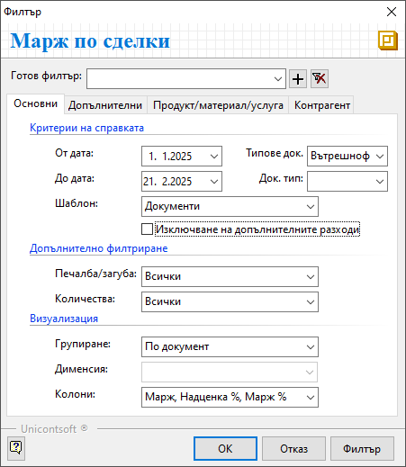

```{only} html
[Нагоре](../000-index)
```

# **Марж и рентабилност на приходите от продажби**

Тази справка сравнява цената и стойността на продуктите по продажби с цената и стойността им на придобиване. Справката работи по избор с данъчни или с вътрешнофирмени документи за продажба.  
В справката системата прави анализ на печалбата/загубата от реализираните продажби. Следят определени показатели - процент на надценка, брутна печалба (марж) като сума и като процент. 

Справката се намира в **Мениджмънт || Марж и рентабилност на приходите от продажби**.  

1) Раздел **Основни**:  

 - **От дата** и **До дата** – в тези полета се определя период, за който се генерира справка;  

 - **Типове док.** - поле за опционален избор на филтър по вътрешнофирмени или данъчни документи;  

 - **Док. тип** - полето дава възможност за избор на един или няколко типа документи;  
 Списъкът в това поле се обзавежда след попълване на предходното поле **Типове док**.  

 - **Шаблони** - изборът на шаблон в това поле - по документи, контрагенти или продукти, определя водещия критерий и вида на справката;  

{ class=align-center }

 - **Печалба/загуба** – справката може да се филтрира, така че да покаже данни по продажби за всички документи (*Всички*), за документи с печалба (*Само с печалба*) или за продажбите на загуба(*Само със загуба*).

 - **Количества** – чрез направения в полето избор справката показва данни с всички продажби (*Всички*), данни за продуктите, изписани от склада и продуктите от туп *Услуга* (*Само издължени*), данни за продадените, но неизписани количества (*Само неиздължени*);  

 - **Групиране** – в полето се избира признак, който да бъде водещ за групиране на записите в справката: *По документ*, *По продукт*, *По контрагент*, *Групаж*;    

 - **Дименсия** - поле за избор на категория за продукти;  
 Този реквизит се активира при определени условия - шаблон *Продукти* и групиране *По дименсия*.  

 - **Колони** - в полето може да се избере вариант на справката, който да включва колони **Марж, Надценка %, Марж %** или **Корична цена, ТО% клиент, ТО% доставчик, Разлика**;  

{ class=align-center }

2) Раздел **Допълнителни** дава възможност за филтриране на данни по склад, поделение, център на себестойност, служител, съставил документите, канал за продажби, групаж.  

3) От раздел **Продукт/материа/услуга** са достъпни критерии за справката, свързани с продукти - *Продукт/мат.*, *Тип*, *Дименсии* и други.  

4) В раздел **Контрагент** за филтър на справката могат да бъдат избрани един или няколко контрагента, типа или категории. 
