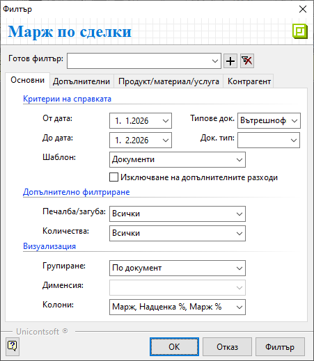

```{only} html
[Нагоре](../000-index)
```

# **Марж и рентабилност**

Справка **Марж и рентабилност на приходите от продажби** е достъпна от меню **Мениджмънт**.  
Тя анализира печалбата/загубата от реализираните продажби. За целта съпоставя цена и стойност на продуктите в продажбите с техните цени и стойности на придобиване. Проследява показатели като процент на надценка и брутна печалба - сума и процент.    
Справката обхваща по избор данъчните или вътрешнофирмените документи за продажба.  

Филтър формата съдържа следните опции за избор на критерии:  

Раздел **Основни**:  

- **От дата** и **До дата** – От тези полета се указва времеви обхват на справката.  

- **Типове док.** - Избира се група документи - вътрешнофирмени или данъчни, данните от които участват в справката.  

- **Док. тип** - Опцията позволява избор на един или няколко типа документи.  
Списъкът в полето варира спрямо избраната в **Типове док.** опция.  

- **Шаблони** - Избраният шаблон определя водещия критерий и вида на справката - по документи, контрагенти, продукти.    

{ class=align-center }

- **Печалба/загуба** – Справката може да се филтрира, така че да покаже данни по продажби за всички документи  
   - *Всички* - Генерираната справка включва всички документи за продажба.  
   - *Само с печалба* - Показва единствено продажби, за които е реализирана печалба.    
   - *Само със загуба* - Показва единствено продажбите с реализирана загуба.  

- **Количества** – Опцията указва кои продажби да влязат в обхвата на справката спрямо свързани складови документи.  
   - *Всички* - Справката включва всички продукти по продажби.  
   - *Само издължени* - Показва данни единствено с продукти, изписани от склада и продуктите от туп *Услуга*.   
   - *Само неиздължени* - Показва данни с продадените продукти, които не са изписани от склад.  

- **Групиране** – Опцията определя водещия признак за групиране на данните: *По документ*, *По продукт*, *По контрагент*, *Групаж*.    

- **Дименсия** - Ограничава справката за избраните категории продукти.    
Този реквизит се активира при определени условия: за шаблон *Продукти* и групиране *По дименсия*.  

- **Колони** - Указва вариант на справката, който включва допълнителни колони: **Марж, Надценка %, Марж %** или **Корична цена, ТО% клиент, ТО% доставчик, Разлика**.  

{ class=align-center }

В раздел **Допълнителни**::  
Дава възможност за филтриране на данни по *Съставил*, *Склад*, *Обект* на потребителя на продукта, *Център на себестойност*, *Канал за продажби*, *Групаж* и други.  

В раздел **Продукт/материа/услуга**  
Опциите за филтриране включват критерии, свързани с *Продукти и материали*, *Типове продукти*, *Дименсии*.  

В раздел **Контрагент**:  
От този раздел на формата могат да бъдат приложени критерии, свързани с *Контрагент*, *Дименсии*, *Тип*, *Обект*, *Търговец*.  