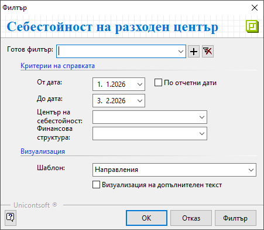
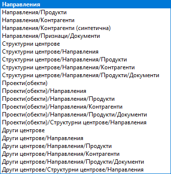

```{only} html
[Нагоре](../000-index)
```

# **Центрове на себестойност**

**Справки върху центрове на себестойност** е достъпна от меню **Мениджмънт**.  
Тази справка дава информация за приходите и разходите по обекти (проекти) за определен период от време. Проследява също движения и  наличности на материали в настроения за обекта склад.  

> Справката обхваща единствено покупки, продажби и складови документи с обзаведени реквизити за финансова структура и центрове на себестойност (раздел **Списъци » Направления**).  

Филтър формата съдържа следните опции за избор на критерии:  

{ class=align-center }


- **От дата** и **До дата** – От тези полета се указва времеви обхват на справката.    

- **Център на себестойност** - От падащия списък могат да бъдат избрани един или няколко обекта/проекта.  
Ако остане празно, се генерира справка за всички разходни центрове.  

- **Финансова структура** - В полето могат да бъдат избрани едно или няколко направления.  
Ако остане празно, справката обхваща всички направления.  

- **Шаблон** – Указва формат на справката.  
Всяка от опциите в списъка представлява различна конфигурациа между направления, структурни центрове, обекти и разпределените им продукти, контрагенти и документи.  

{ class=align-center }

- **Визуализация на допълнителен текст** - При активиране на опцията справката показва **Допълнителен текст**, въведен в документите от раздел **Списъци » Направления**.      