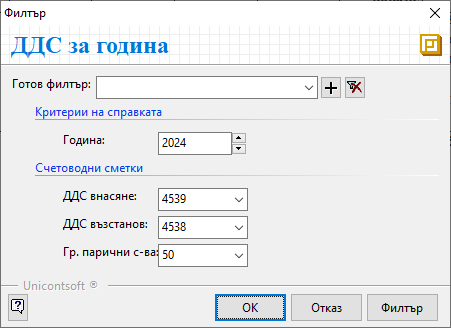

```{only} html
[Нагоре](../000-index)
```

# **ДДС за година**

Справката дава информация за начисления ДДС по данъчни документи за покупки и продажби. Данните са представени като обща сума за всеки месец от избраната година и включват справка с ДДС за възстановяване или внасяне, прихванато, платено, възстановено и остатъка за внасяне.  

Справката се намира в **Мениджмънт || ДДС за година**.  
Във филтър формата задължително се избира **Година**, за която се генерира направите справка.  

В полетата със счетоводни сметки се избират тези, които са настроени в **Сметкоплан** за внасяне и възстановяване на ДДС, както и групата за парични средства.     
Обикновено това са с/ка 4539 (ДДС за внасяне), с/ка 4538 (ДДС за възстановяване) и група 50 (парични средства).  

{ class=align-center }

> Ако не бъдат избрани точните счетоводни сметки, данните в справката няма да бъдат коректни.