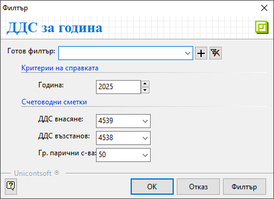

```{only} html
[Нагоре](../000-index)
```

# **ДДС за година**

Справка **ДДС за година** е достъпна от меню **Мениджмънт**.  
Показва начислен ДДС в данъчни документи за покупка и продажба, като съпоставя данните по дневници и по счетоводни сметки.  
Справката дава ДДС резултат за периода. Това включва суми с ДДС за възстановяване или внасяне, прихванато, платено, възстановено и остатъка за внасяне.  

Филтър формата съдържа следните опции за избор на критерии:  

{ class=align-center }

- **Година** - Задължително се указва годината, за която се генерира справката.  
- **ДДС внасяне** - От полето се отваря списък с настроения **Сметкоплан**.  
Маркира се сметката, която се използва за ДДС за внасяне (напр. с/ка *4539 - ДДС за внасяне*).  
- **ДДС възстановяване** - Полето се попълва със сметката, настроена за ДДС за възстановяване (напр. с/ка *4538 - ДДС за възстановяване*).  
- **Гр. парични с-ва** - От падащия списък се маркира групата счетоводни сметки, избрана за отчитане на парични средства.  
Обикновено това е група *50 - Парични средства*.      

> Неправилната конфигурация на счетоводни сметки във филтъра ще доведе до некоректни данни в справката.  