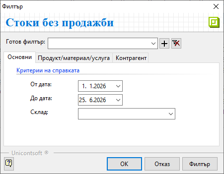
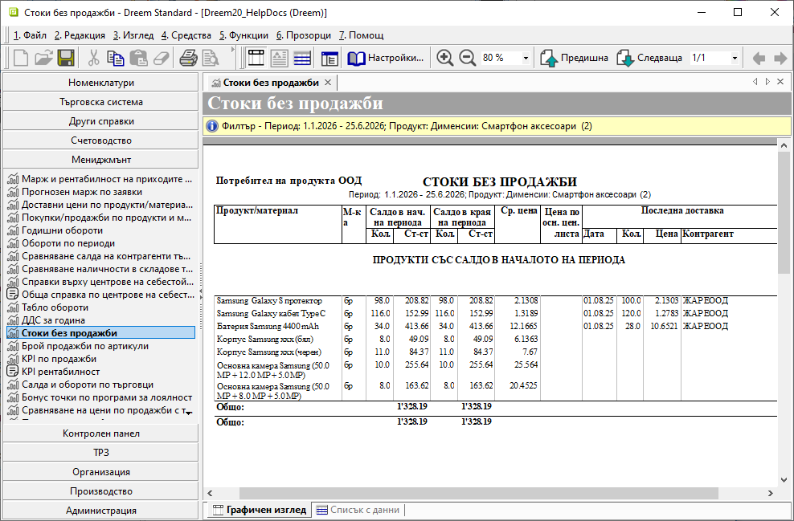
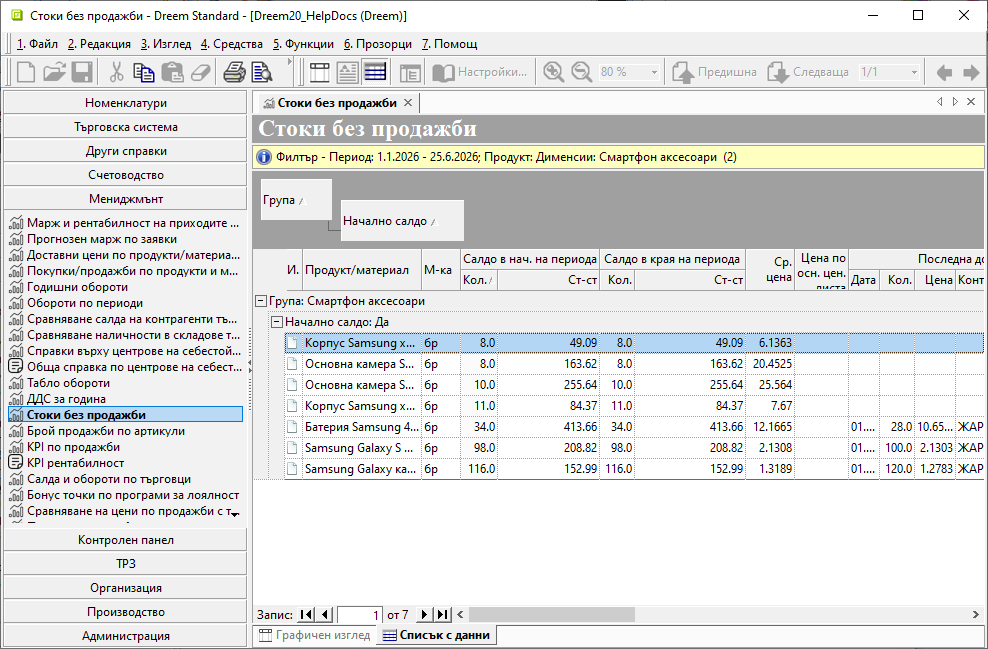

```{only} html
[Нагоре](../000-index)
```

# **Стоки без продажби**

Справка **Стоки без продажби** е достъпна от меню **Мениджмънт**.  
Показва всички стоки и техните наличности, които не участват в продажби от избрания период. Обхватът на справката може да бъде ограничен до отделни продукти, дименсии и/или типове на продукти.   


Филтър формата съдържа следните опции за избор на критерии:  

{ class=align-center }

В раздел **Основни**:  

- **От дата** и **До дата** - В тези полета се указва период, за който се филтрират данни.  
Ако останат празни, системата приема, че няма начална и/или крайна дата.  

- **Склад** - От полето могат да бъдат избрани един или няколко склада.    
Ако остане празно, справката ще включва обобщени данни за всички складове.  

В раздел **Продукт/материал/услуга**:  
От този раздел се прилагат критерии за филтриране за един или няколко параметъра: **Продукт**, **Дименсии** и **Тип**.  

В раздел **Контрагент**:  
От този раздел могат да бъдат приложени критерии за филтриране по **Последен доставчик**.   

{ class=align-center w=15cm }

От изглед **Списък с данни** справката може да бъде групирана и сортирана по различни критерии. Например могат да бъдат изведени продуктите без продажби, за които няма наличност в указания склад/ове.  

{ class=align-center w=15cm }