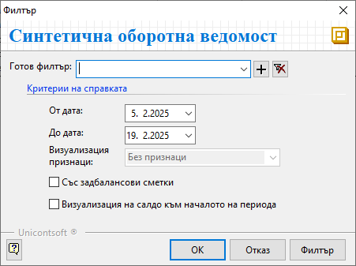
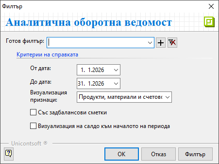
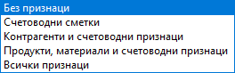

```{only} html
[Нагоре](../000-index)
```

# **Оборотна ведомост**

В системата има на разположение синтетична и аналитична оборотна ведомост. Те са достъпни от меню **Счетоводство**.   

Данните в двете справки са представени в еднакъв формат. Разликата е в степента на детайлност.  
В **Синтетична оборотна ведомост** информацията е обобщена по основни счетоводни сметки, докато **Аналитична оборотна ведомост** показва счетоводни подсметки и признаци.  

##  **Синтетична оборотна ведомост**

Тази справка показва начално салдо, обороти и салдо в края на периода по синтетични счетоводни сметки.  

Филтър формата съдържа следните опции за избор на критерии:

{ class=align-center }

- **От дата** и **До дата** - В тези полета се указва времеви обхват за справката.  

- **Със задбалансови сметки** - При активиране на опцията справката обхваща и данните по задбалансови сметки.  

- **Визуализация на салдо към началото на периода** - При поставяне на отметка в справката се визуализира колона **Салдо към началото на периода**.  
Ако полето остане пазно, се визуализира колона **Оборот до началото на периода**. Това е оборотът по сметка от 1 януари до началната дата от избрания период в справката.   

## **Аналитична оборотна ведомост**  

Справката показва начално салдо за годината, обороти и салдо в края на избрания период по счетоводни подсметки.  

Филтър формата съдържа следните опции за избор на критерии:

{ class=align-center } 

- **От дата** и **До дата** - Избира се период за справката.   

- **Визуализация признаци** - Чрез опциите се указва различен вид допълнителна информация, която се визуализира за сметките.  

   { class=align-center }   

- **Със задбалансови сметки** - С активиране на тази опция справката показва и данните по задбалансови сметки.  

- **Визуализация на салдо към началото на периода** - При поставена отметка в полето справката визуализира колона **Салдо към началото на периода**.  
Ако остане празно, в справката се визуализира колона **Оборот до началото на периода**. Това е оборотът по сметка от 1 януари до началната дата на избрания период в справката.   
