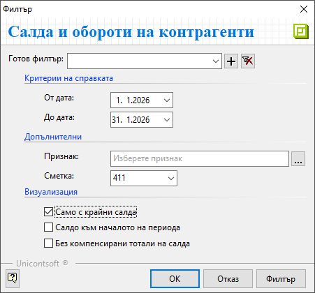

```{only} html
[Нагоре](../000-index)
```

# **Салда и обороти на контрагенти**

Справката **Салда и обороти на контрагенти** е достъпна от меню **Счетоводство**.  
Проследява данни по счетоводни сметки с вземания и задължения за контрагенти. Справката включва начално салдо за годината, обороти и салда в края на периода.  

Филтър формата съдържа няколко опции с критерии за справката.  

{ class=align-center } 

- **От дата** и **До дата** - В тези полета се указва времеви обхват за справката.  

- **Признак** - От бутона [**...**] след полето се отваря списък със счетоводни признаци. Може да бъде избран само един контрагент, за който се генерира справка.  
Полето може да остане празно и справката да вклюва всички контрагенти.  

- **Сметка** - В полето се отваря списък с настроения **Сметкоплан**. Избира се счетоводна сметка, за която се извършва справка.  

- **Само с крайни салда** - Чрез опцията справката може да бъде ограничена до контрагенти с неплатени документи към края на периода.  

- **Салдо към началото на периода** - При активиране на опцията се визуализира колона **Салдо към началото на периода**. С това справката показва началните салда за избрания период в **От дата**.  


