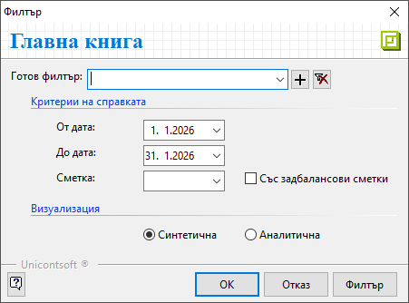

```{only} html
[Нагоре](../000-index)
```

# **Главна книга**

Справка **Главна книга** е достъпна от меню **Счетоводство**.   
Показва салда и обороти по счетоводни сметки заедно с кореспондиращите им сметки от операциите през периода.   

Филтър формата съдържа няколко опции с критерии за справката.  

{ class=align-center } 

- **От дата** и **До дата** - В тези полета се указва времеви обхват на справката.  

- **Сметка** - В полето се отваря списък за избор на счетоводна сметка от настроения **Сметкоплан**. Може да остане празно и справката да включва всички счетоводни сметки.  

- **Със задбалансови сметки** - При активиране опцията справката показва данни по задбалансови сметки.  

- **Визуализация**:  
    - **Синтетична** - Данните в справката са представени по основни сметки.    
    - **Аналитична** - Справката визуализира изпозлваните подсметки.    
