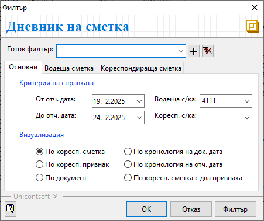

```{only} html
[Нагоре](../000-index)
```

# **Дневник на сметка**

Справка **Дневник на сметка** е достъпна от меню **Счетоводство**.  
Проследява регистрираните операции за избрана водеща сметка. Това включва детайли за кореспондиращи сметки и счетоводни документи в периода (вкл. дата, номер и стойности).  

Филтър формата съдържа различни опции с критерии за справката.  

{ class=align-center } 

В раздел **Oсновни**:  

- **От отч. дата** и **До отч. дата** - В тези полета се указва времеви обхват за справката.  

- **Водеща с/ка** - Отваря списък със **Сметкоплан** за избор на основна сметка за справката.  

- **Коресп. с/ка** - Поле за избор на кореспондираща сметка за справката. Може да остане празно и справката показва всички кореспонденции на водещата сметка.  

- **Визуализация** - Чрез опциите се избира формат на справката - по документи, по хронология, по кореспондиращи сметки и/или признак.    

В раздел **Водеща сметка**:  
Търсенето може да се ограничи по избрани критерии, отнасящи се до основната сметка - признак, документ тип, документ номер, документ дата, валута или мярка.  

В раздел **Кореспондираща сметка**:  
Опциите в този раздел обхващат критерии, касаещи кореспондиращата сметка.  
