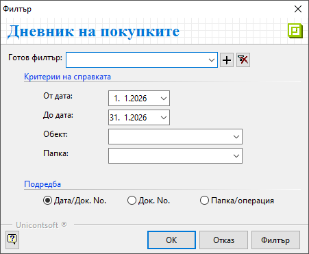

```{only} html
[Нагоре](../000-index)
```

# **Дневник на покупките**

Справка **Дневник на покупките** е достъпна в меню **Счетоводство**.  
Проследява данъчни документи за покупка за избран период.  
Справката е изготвена според указанията на НАП и покрива критериите за структуриране на информацията за:  
   - Вид, номер и дата на документ  
   - Контрагент - идентификационен номер и наименование  
   - Вид на стоката/услугата  
   - Данъчна основа и ДДС, разпределени по колони в дневника според вида на сделката  

> Справката показва единствено покупките с приключени счетоводни документи.   

Филтър формата съдържа няколко опции с критерии за справката.  

{ class=align-center } 

- **От отч. дата** и **До отч. дата** - В тези полета се указва времеви обхват на справката.  

- **Обект** - От полето може да бъде избран обект, за който се визуализират данни в справката.   

- **Папка** - Полето позволява справката да бъде ограничена за избрана папка от настроените в **Референтни номенклатури » Счетоводство**.  

- **Подредба** - Чрез опциите се избира различен формат за визуализация на справката.  
Вариантите за водещи критерии при сортиране на документите са:  
    - Дата и пореден номер на документа;  
    - Пореден номер на документа;  
    - Папка или операция;  
