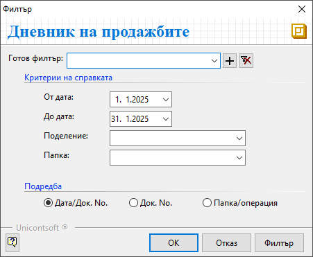

```{only} html
[Нагоре](../000-index)
```

# **Дневник на продажбите**

Тази справка дава информация за всички данъчни документи за продажба, валидирани със счетоводни записи в системата за избран период.   
Справка **Дневник на продажбите** е разработена според изискванията на НАП и съдържа необходимите реквизити с информация за:  
    - вид, номер и дата на документ;  
    - контрагент - идентификационен номер и наименование;  
    - вид на стоката/услугата;  
    - данъчна основа и ДДС, разпределени по колони в дневника според вида на сделката; 

Справката се намира в **Счетоводство » Дневник на продажби**.  

- **От отч. дата** и **До отч. дата** - полета за избор на период за справката; 

- **Обект** - от полето може да бъде избран обект, за което да се визуализират данните в справката;   

- **Папка** - от това поле справката може да бъде ограничена по определена папка;  

- **Подредба**  - опции за формат, в който да се визуализира справката;  
Водещ критерий за сортиране на документите могат да бъдат:  
    - Дата на документа и пореден номер на документа;  
    - Пореден номер на документа;  
    - Папка или операция;  

{ class=align-center } 


