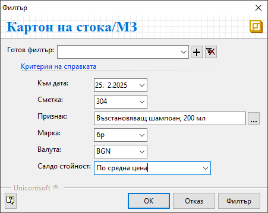

```{only} html
[Нагоре](../000-index)
```

# **Картон на стока/МЗ**

Справката се използва за детайлно проследяване състоянието на избран продукт.  
Картонът на стока представя хронологична информация с количества, среднопретеглена цена и стойност на прихода, разхода и наличността.   

Тази справка се намира в **Счетоводство || Картон на стока/МЗ**.  

- **Към дата** - поле за избор на крайна дата на справката;  

- **Сметка** - в полето се отваря настроеният списък със счетоводни сметки - **Сметкоплан**;  
Възможно е да се избере само една сметка за текущата справка.  

- **Признак** - от бутон [**...**] в края на полето се отваря списък със счетоводни признаци;  
Възможно е да се избере само един продукт, за който се генерира справката.  

- **Мярка** - в това поле се избира мерна единица, отговаряща на продукта в справката;  

- **Валута** - в полето може да бъде избрана валута за справката;  

- **Салдо стойност** - възможност за избор по каква цена да бъде представено салдото в справката - *По средна цена* или *По цена от документа*;  

{ class=align-center } 
