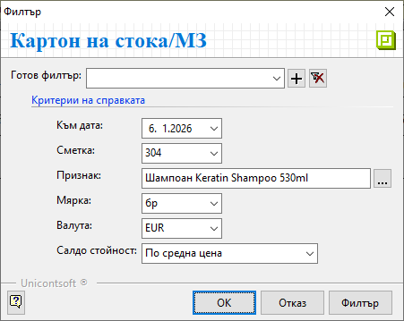
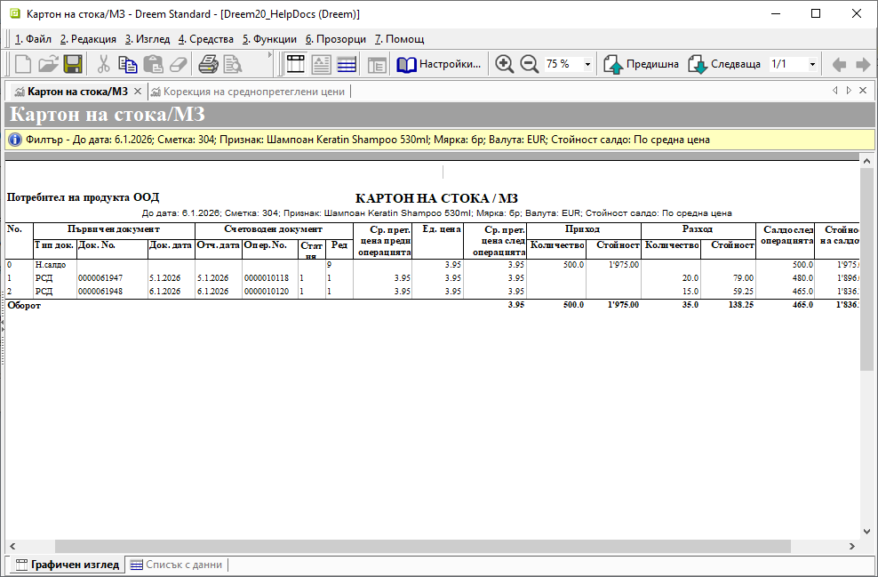

```{only} html
[Нагоре](../000-index)
```

# **Картон на стока/МЗ**

Справка **Картон на стока/МЗ** е достъпна в меню **Счетоводство**.  
Проследява хронологията и моментното състояние на един продукт към избрана дата. Това включва информация за количества, среднопретеглена цена и стойност на прихода, разхода и наличността.   

Филтър формата съдържа няколко опции с критерии за справката.  

{ class=align-center } 

- **Към дата** - Указва крайна дата на периода за справката.  

- **Сметка** - Отваря се списък за избор на счетоводна сметка от настроените в **Сметкоплан**.  

- **Признак** - От бутон [**...**] в края на полето се отваря форма за избор **Счетоводни признаци**.  
Възможно е да се избере само един продукт, за който се генерира справката.  

- **Мярка** - Полето се попълва с мерната единица, отговаряща на избрания продукт.    

- **Валута** - Може да бъде указана различна валута за справката.  

- **Салдо стойност** - Опцията определя по каква стойност да бъде представено салдото в справката - *По средна цена* или *По цена от документа*.  

{ class=align-center w=15cm } 