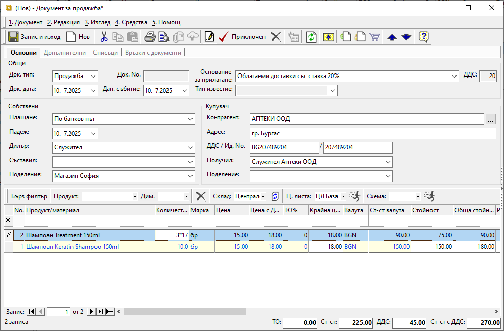
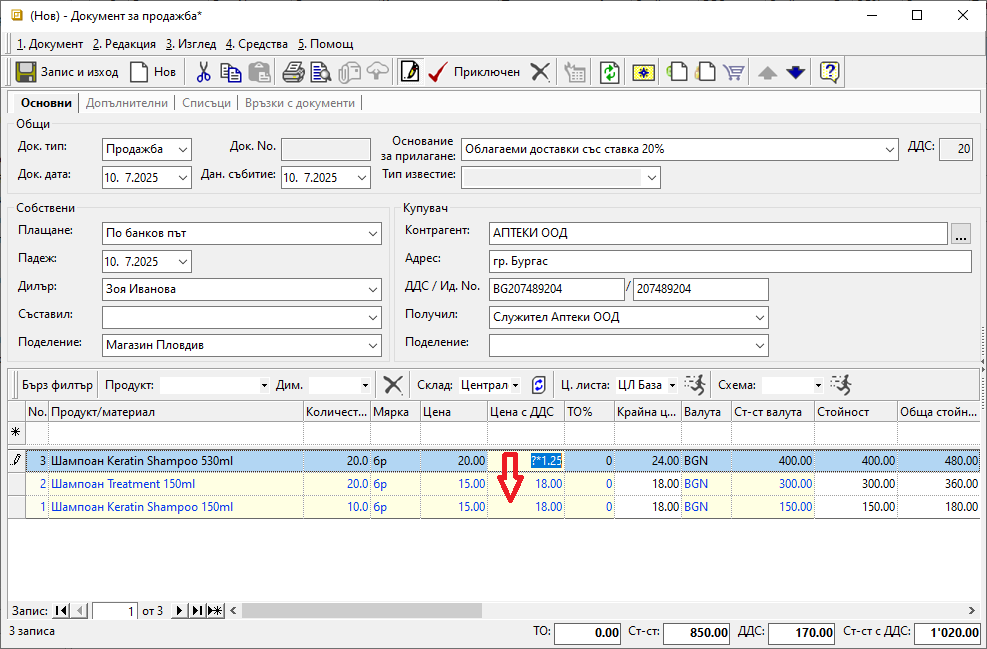

```{only} html
[Нагоре](000-index)
```

# Вграден калкулатор

В системата е реализиран вграден калкулатор, достъпен в колоните с числова стойност. Такива са например полетата в колони **Количество**, **Цена (Цена с ДДС)**, **ТО%**, **Ст-ст валута** от формите за редакция на номенклатури и документи.  
Това позволява да се извършват основни математически операции (събиране, изваждане, умножение, деление) на избрани редове. 

Този вграден инструмент работи за документи, когато са в състояние *Редакция*.  

Калкулаторът се използва след позициониране в избраното поле и въвеждане на желаната операция.  
С бутон [Enter] действието се потвърждава, при което системата преизчислява новите стойности спрямо извършените промени.  

{ class=align-center w=15cm }

Чрез калкулатора може да се въведе формула, която да се размножи по редове на колоната. Това е ефективно средство, даващо възможност на потребителя за бързо преизчисляване на стойности в множество редове.  

Пример: В документ за продажба цена с ДДС трябва да се увеличи с 25% за всички продукти.  

{ class=align-center w=15cm }

Позиционирате се в крайно поле от колона **Цена с ДДС**. Маркирате текущата цена и на нейно място въвеждате формулата: ?*1.25. Чрез задържане на **Ctrl + Shift + стрелка** формулата се копира до края на списъка с продукти.

При така зададената формула, системата автоматично замества знак [**?**] с текуща цена на реда и я умножава с 1.25.  
С преизчисляване на новите цени се актуализират и тоталите на документа.  
