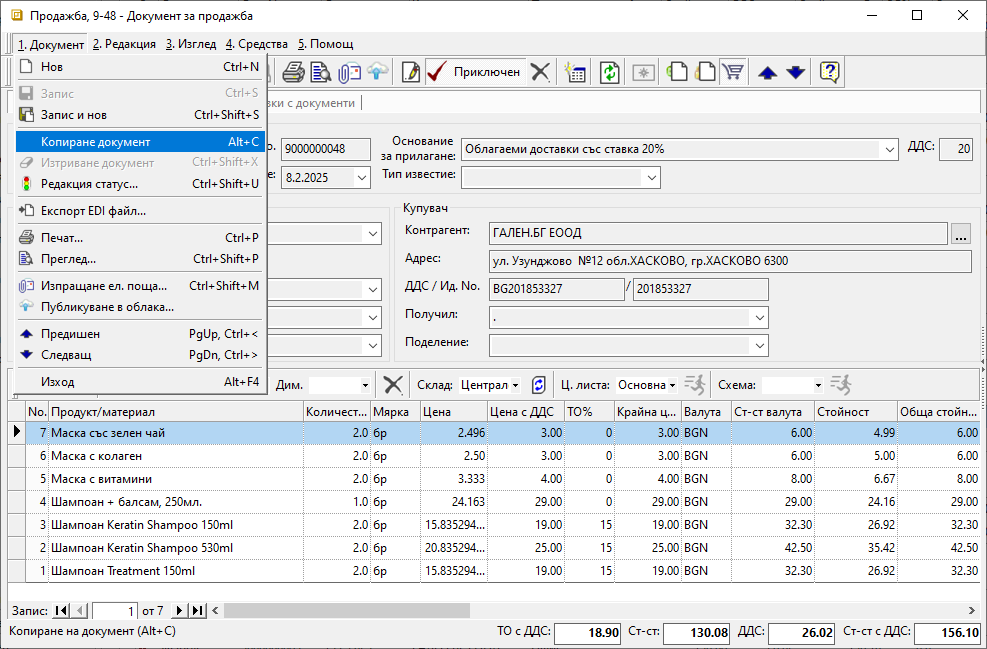

```{only} html
[Нагоре](000-index)
```

# **Копиране на документ**

В практиката често се налага създаване на документ, съвпадащ по съдържание с вече въведен такъв. В тези случаи най-удобно е новият документ да бъде създаден чрез копиране.  

Опцията е достъпна от меню **1.Документ || Копиране документ** във форма за редакция на избрания документ.  

{ class=align-center w=15cm }

За да се направи копие, първо трябва да бъде отворен документът, който служи за образец. Потвърждава се опцията **Копиране на документ** или клавишната комбинация **ALt+C**.  
Системата създава нов документ със съдържанието на документа - източник на информация.  

Новият документ е в състояние *Редакция*. Обработката му може да продължи до валидиране чрез *Приключен*.  
