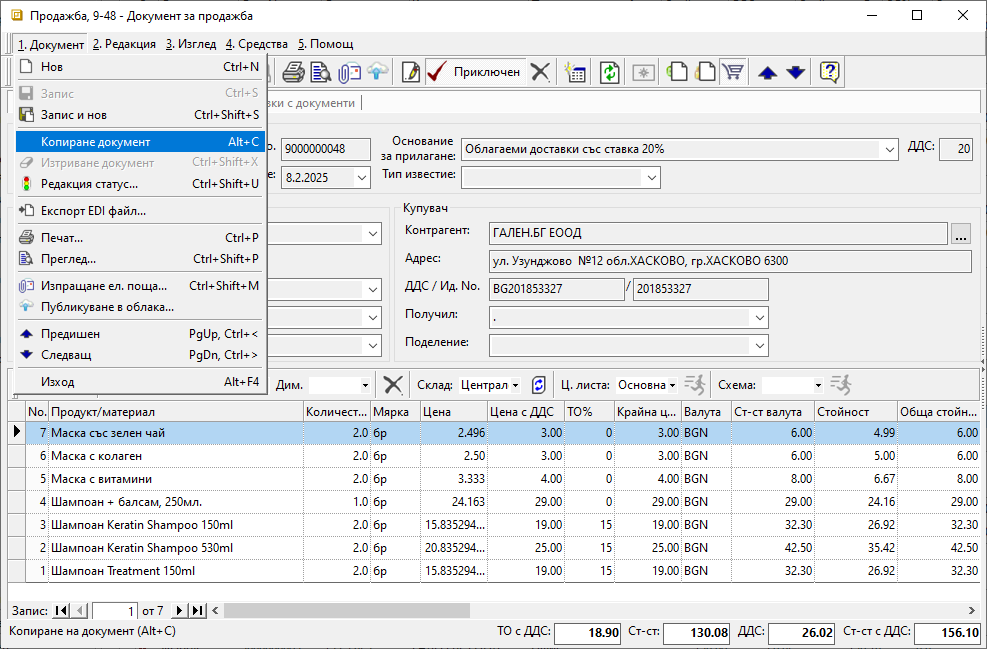

```{only} html
[Нагоре](000-index)
```

# **Копиране на документ**

В практиката често се налага създаване на документ, съвпадащ по съдържание с вече въведен такъв. В тези случаи новият документ може да бъде създаден чрез копиране.   

{ class=align-center w=15cm }

За създаването на копие на документ се изпълняват следните стъпки:  

- Отваря се формата за редакция на избрания документ-образец.  
- Избира се опцията **Копиране на документ**. Тя е достъпна от меню **Документ** или чрез клавишна комбинация **ALt+C**.   
- Системата създава документ-копие. Той е отворен на екран и в състояние *Редакция*. Обработката му може да продължи до валидиране чрез *Приключен*.  
