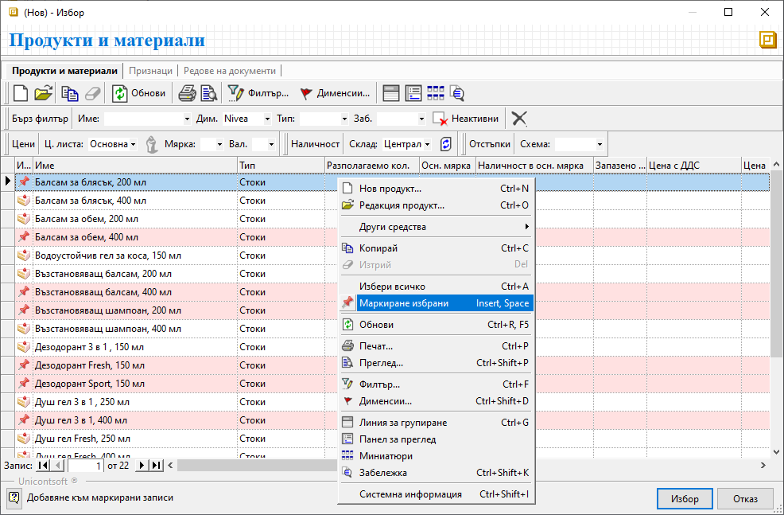

```{only} html
[Нагоре](000-index)
```

# **Маркиране на записи**

В системата имам различни варианти за маркиране на множество записи в списък. Освен стандартните клавишни комбинации с [Ctrl] или [Shift] + маркиране на редове, има и друг удобен вариант. Той е особено подходящ, когато трябва да се селектират непоследователни записи в голям по обем списък.  

Опцията е достъпна след позициониране върху избран ред (запис) чрез десен бутон **Маркиране избрани**, както и чрез клавиши [**Insert**] или [**Space**] (бутон за интервал).  

Избраните по този начин редове се оцветяват в розово и остават перманентно маркирани.  

{ class=align-center w=15cm }

Могат да бъдат маркирани неограничен брой записи, без да има значение тяхната последователност.  

> Маркировката на селектираните редове се запазва при използване на **Бърз филтър** и след промяна на критериите за търсене.  

Маркировката се премахва отново чрез позициониране върху реда и [Insert] или [Space].
