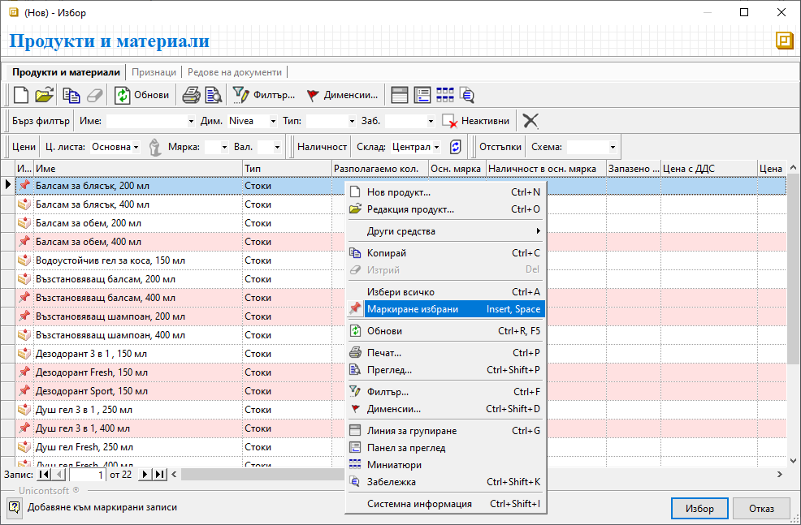
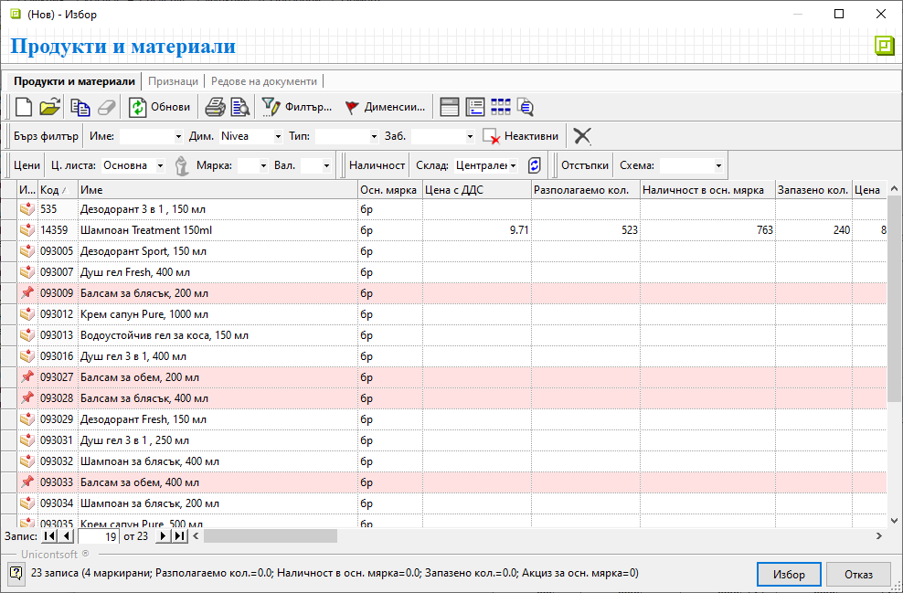

```{only} html
[Нагоре](000-index)
```

# **Маркиране на записи**

Системата поддържа различни варианти за маркиране на множество записи в списък.  
Прилагат се стандартните клавишни комбинации с [**Ctrl**] и [**Shift**] + маркиране на редове. Наред с тях има алтернатива, особено подходяща за селектиране на непоследователни записи в дълги списъци.  

> Могат да бъдат маркирани неограничен брой записи без тяхната последователност да има значение.  

Изберете ред със запис, като се позиционирате върху него. Потвърдете маркировката чрез едно от следните:  

- Десен клик и опция **Маркиране избрани**  
- Клавиш [**Insert**]  
- Клавиш за интервал    

Избраните по този начин редове се оцветяват в розово. Остават маркирани докато изрично не промените това.  

Премахвате маркировката отново с позициониране на реда и клавиш [**Insert**], [**Space**] или десен клик и опция **Маркиране избрани**.  

{ class=align-center w=15cm }

Особено удобно е да използвате метода в списък **Продукти и материали**. Маркировката на селектираните редове се запазва дори след промяна на търсенето в **Бърз филтър**.  

{ class=align-center w=15cm }
