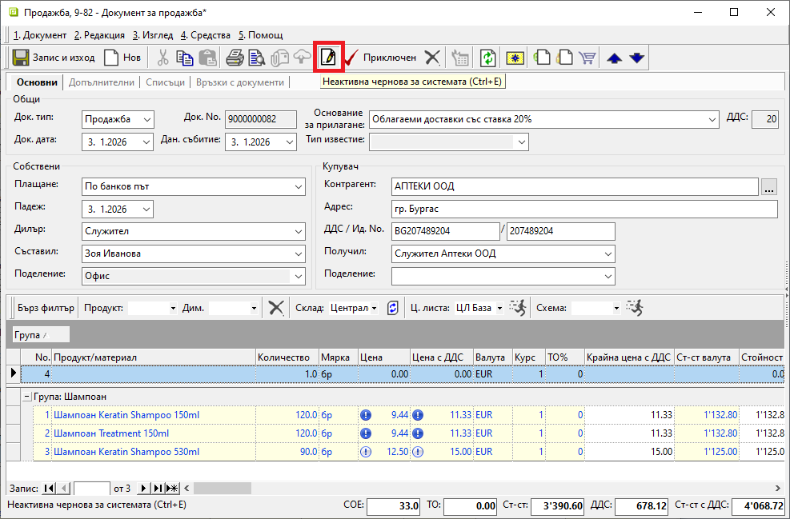
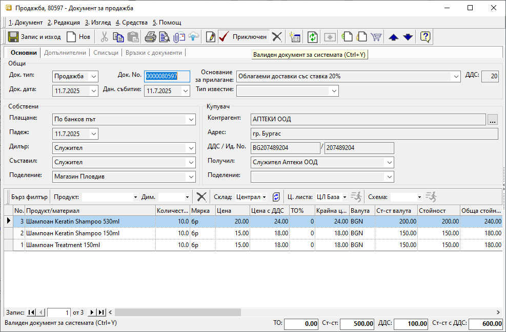
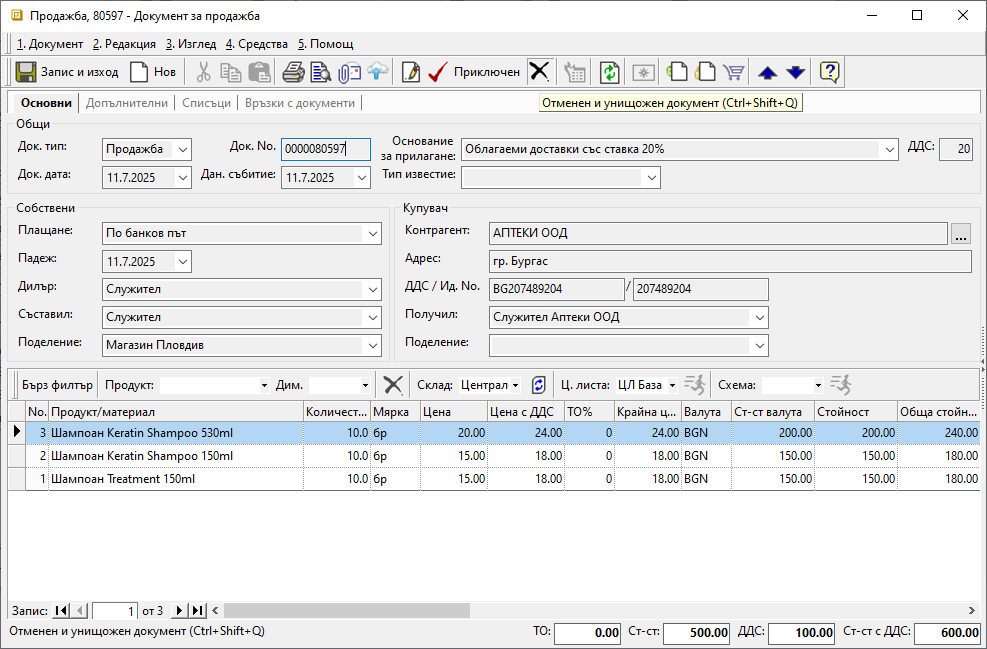

```{only} html
[Нагоре](000-index)
```

# **Състояния на документите**

Документите в системата имат три състояния - **Редакция**, **Приключен** и **Анулиран**. Те определят степента им на завършеност и валидността им по отношение на справките.  

В общия случай анулираните документи и тези в състояние на редакция не участват в справки. Изключения правят няколко специфични справки.   

1) **Редакция** — неактивна чернова;  
Документите в редакция са т.нар. чернови, които са неактивни за печат от форма за редакция и не участват в справки. Могат да бъдат разпечатани от списък с документи.  
При запис получават служебни номера като E1, E2 и т.н.  

{ class=align-center w=15cm }

2) **Приключен** — валиден документ;  
Това са активните документи в система, които са валидни за печат и справки.  
При валидиране всеки документ получава пореден номер в системата според дефинираните в **Номератори**.  

{ class=align-center w=15cm }

3) **Анулиран** —  отменен и унищожен;  
Документи в системата, които са унищожени по някаква причина и придобиват неактивно състояние. Анулираните документи не участват в справки, но са активни за печат.  
Системата не променя номерата на документите при анулирането им.  

{ class=align-center w=15cm }

> Документи, които могат да бъдат свободно изтривани в системата, са счетоводните записи.  Условието е предварително да бъдат анулирани.  
