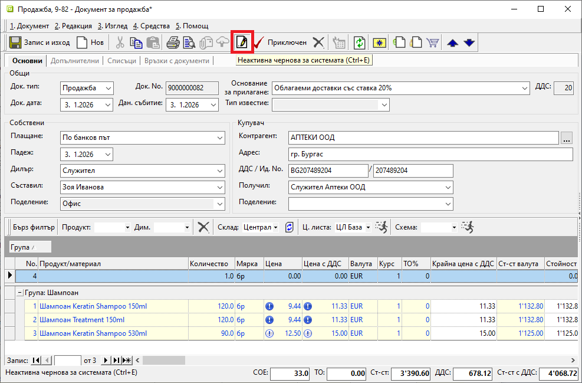
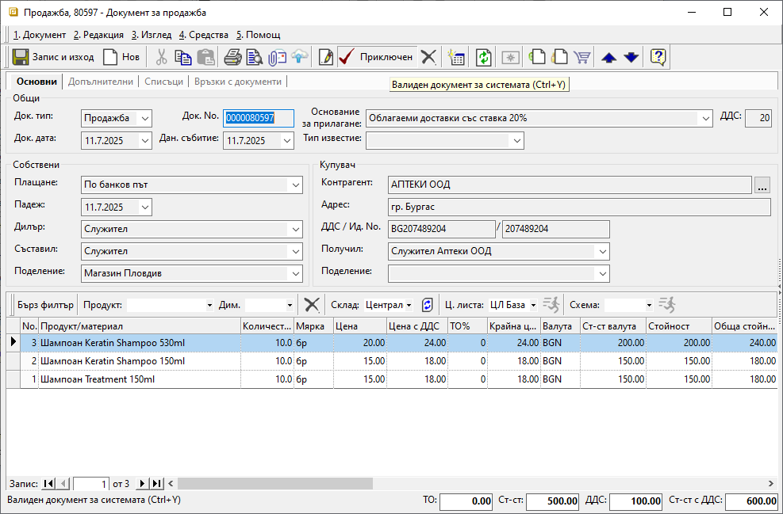
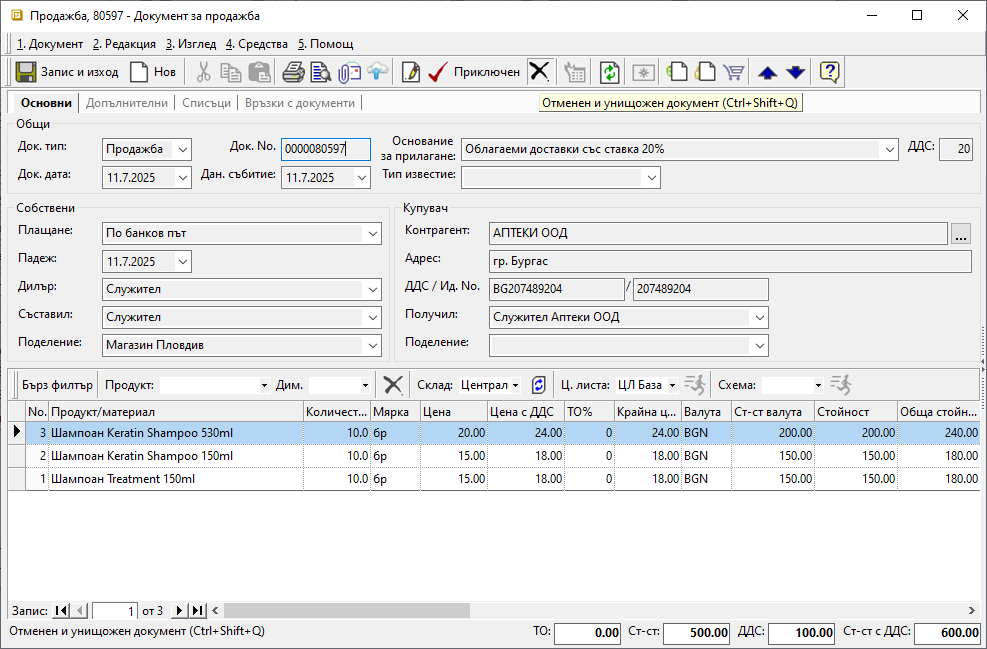

```{only} html
[Нагоре](000-index)
```

# **Състояния на документите**

Документите в системата имат три състояния - **Редакция**, **Приключен** и **Анулиран**. Те определят степента им на завършеност и валидността им по отношение на справките.  

> В общия случай анулираните документи и тези в състояние на редакция не участват в справки. Изключения правят няколко специфични справки.   

1) **Редакция** (неактивна чернова)  
Това е първоначалното състояние за всеки нов документ. В последствие той може да бъде приключен или анулиран.  
Документите в редакция са т.нар. чернови, които не участват в справки.    

{ class=align-center w=15cm }

2) **Приключен** (валиден документ)  
Това са активните документи в системата, които са валидни за всички справки.  
В състояние **Приключен** могат да преминат както документи в редакция, така и анулирани документи.   

> При валидиране документът получава пореден номер в системата според дефинираните в **Номератори**.  

{ class=align-center w=15cm }

3) **Анулиран** (отменен и унищожен)  
Това са документи, които по някаква причина са унищожени и придобиват неактивно състояние. Те не участват в справки.  
Системата не променя номерата на документите при анулирането им.   
В състояние **Анулиран** могат да преминат както документи в редакция, така и приключени документи.   

> Анулираните документи не се изтриват от системата.   
Единствено анулирани счетоводни записи могат да бъдат изтривани свободно.  

{ class=align-center w=15cm }

```{tip}
Промяна в състоянието за избрани или за всички документи може да бъде ограничено чрез настройка на права по групи потребители.  
```