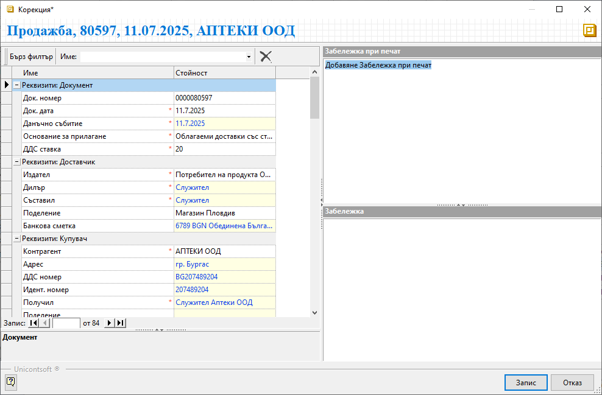

```{only} html
[Нагоре](000-index)
```

# Корекция приключен документ

Често заради пропуск или греша се налага корекция на вече валидиран в системата документ. Освен чрез връщане на документа в редакция, съществува и друг начин за нанасяне на корекции във вече валидиран документ. При това не се изисква промяна на неговия статус. Разбира се чрез такъв тип корекция можем да редактираме само определени реквизити от документа, които на практика не променят неговата стойност.
Нека разгледаме как става това в няколко стъпки.

1) **Корекция приключен документ** - Опцията е достъпна от меню **Средства** във форма за редакция на документ.  

2) **Реквизити** - Системата отваря форма с избрани реквизити на документа.  
Всички оцветени в жълто полета позволяват промяна на данните в тях. Могат да бъдат добавени също *Забележка* и/или *Забележка при печат*.  

{ class=align-center w=15cm }

3) **Запис** — Бутонът потвърждава нанесените промени. Системата отразява новите данни в документа, без да променя неговото състояние.  
