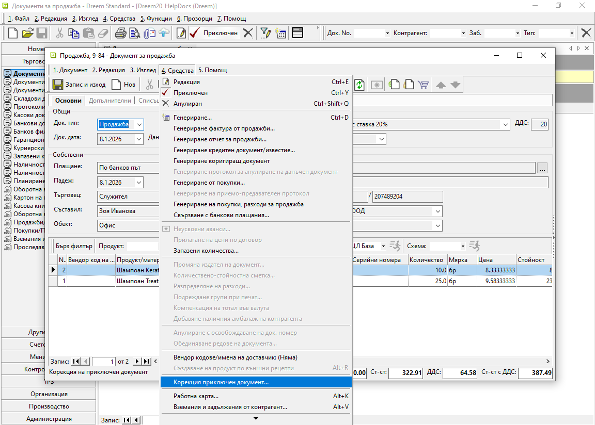
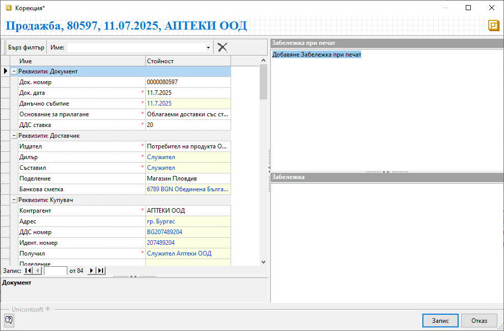

```{only} html
[Нагоре](000-index)
```

# **Корекция приключен документ**

Често, заради пропуск или грешка, се налага редактиране на вече валидиран документ в системата. Документът може да бъде върнат в редакция. Това дава достъп до пълното му съдържание и могат да бъдат нанасяни корекции.  

Друг вариант за редактиране е използването на вградения инструмент **Корекция приключен документ**. Той е достъпен от форма за редакция на документ в меню **Средства**.  

> При използване на опцията **Корекция приключен документ** не променяте състоянието на документа. Той остава приключен.     

{ class=align-center w=15cm }

Системата отваря форма с избрани реквизити на документа.  
Можете да променяте данните във всяко от жълтите полетата, както и да добавите *Забележка* и/или *Забележка при печат*.  

{ class=align-center w=15cm }

Потвърдете направените промени с бутон [**Запис**].  
Системата попълва новите данни в документа, като по време на процеса запазва неговото състояние.  
