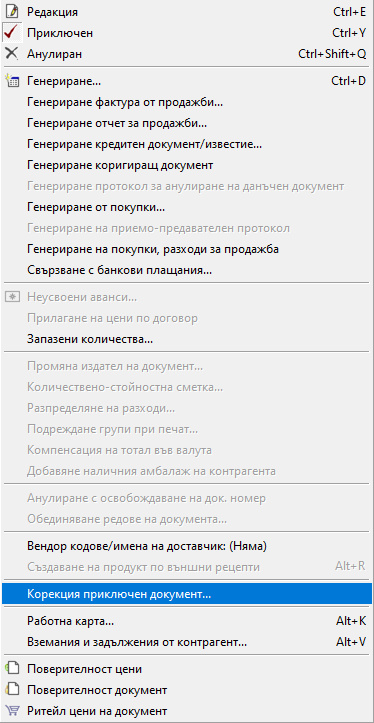

```{only} html
[Нагоре](000-index)
```

# **Корекция приключен документ**

Често - заради пропуск или грешка, се налага корекция на вече валидиран в системата документ. Корекции могат да бъдат нанесени чрез връщане на документа в редакция. Това дава достъп до пълното съдържание на документа.  

Друг вариант за редактиране е използването на вградения инструмент **Корекция приключен документ**. Това не изисква промяна в състоянието на документа. В този случай са достъпни за корекция само определени реквизити от документа.  

Опцията е достъпна от меню **Средства** във форма за редакция на документ.  

{ class=align-center w=15cm }

Системата отваря форма с избрани реквизити на документа.  
Всички оцветени в жълто полета позволяват промяна на данните в тях. Могат да бъдат добавени също *Забележка* и/или *Забележка при печат*.  

{ class=align-center w=15cm }

С бутон [**Запис**] се потвърждават нанесените промени. Системата отразява новите данни в документа, запазвайки неговото състояние.  
