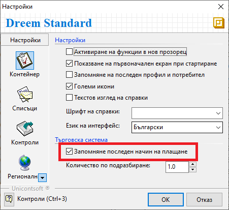
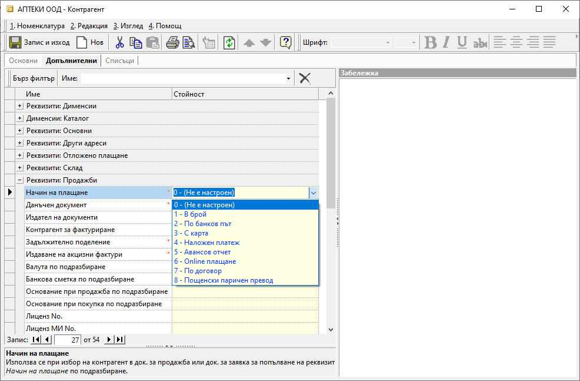

```{only} html
[Нагоре](000-index)
```

# **Начин на плащане**

Системата разполага с различни настройки, касаещи начин на плащане по подразбиране в нова продажба.  

Едната възможност е прилагане на последно използвания начин на плащане. Системата го следи отделно в документите за покупка и за продажба.  

Друга възможност е индивидуална настройката по контрагенти.  
В този случай при избор на контрагент в нов документ се прилага изрично настроения за него начин на плащане.   
 
## Последен начин на плащане

Опцията е достъпна от лентата с основно меню в **Средства » Настройки**. Това отваря се форма **Настройки - Dreem Standard**, в която се избира секция **Контейнер**. Настройката се активира/деактивира чрез поставяне/махане на отметка в **Запомняне последен начин на плащане**.  
Направените промени трябва да бъдат потвърдени с бутон [**Ок**].

> Опцията работи, когато за контрагента в документа няма дефинирани индивидуални настройки.  


{ class=align-center }

## Начин на плащане по контрагент

Индивидуалната настройка за начин на плащане е достъпна от форма за редакция на контрагент в раздел **Допълнителни » Реквизити: Продажби**.   
Системата прилага тази настройка в нова продажба, след като бъде избран контрагент.  

Направените промени трябва да бъдат потвърдени с бутон [**Запис и изход**].  

{ class=align-center w=15cm }

> При създаване на нов документ чрез копиране, системата не се съобразява с настройката за **Запомняне последен начин на плащане**.  
Взема се начин на плащане от документа - образец.