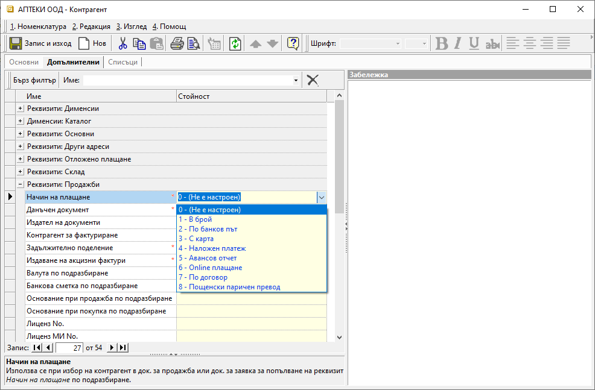

```{only} html
[Нагоре](000-index)
```

# Начин на плащане

Системата разполага с различни настройки за начин на плащане по подразбиране.  
Едната възможност е за настройка на последния начин на плащане по подразбиране. Системата я прилага отделно за покупки и за продажби. Така в нова покупка или продажба системата предлага последно използвания начин на плащане за съответния тип.  
Опцията работи, когато за контрагента в документа няма направени индивидуални настройки.  

Друга възможност е индивидуална настройката по контрагенти. В този случай при нов документ системата прилага изрично настроения за контрагента начин на плащане.   
 
## Последен начин на плащане

Опцията е достъпна от основното меню в **4.Средства || Настройки...**.  
Отваря се форма **Настройки - Dreem Standard**, в която се избира секция **Контейнер**. Настройката се активира/деактивира чрез поставяне/махане на отметка в **Запомняне последен начин на плащане**.  
Направените промени трябва да бъдат потвърдени с бутон [Ок].

{ class=align-center }

## Начин на плащане по контрагент

Настройката е достъпна във форма за редакция на **Контрагент** в панел **Допълнителни || Реквизити: Продажби**. При нея системата ще предлага този начин на плащане, когато за избрания контрагент се създава нова продажба.  
Направените промени трябва да бъдат потвърдени с бутон [Запис и изход].  

{ class=align-center w=15cm }

> При създаване на нов документ чрез копиране, системата не се съобразява с настройката за **Запомняне последен начин на плащане**.  
Взема се начин на плащане от документа - образец.