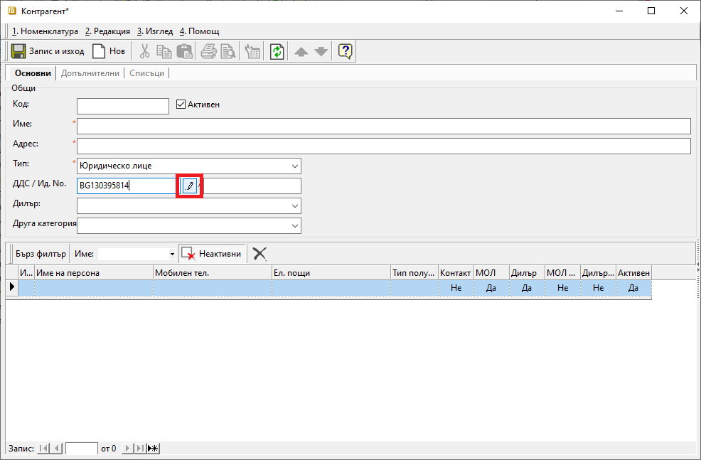
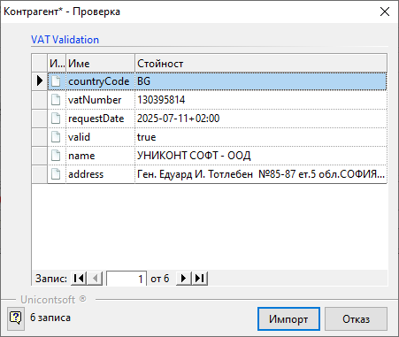

```{only} html
[Нагоре](000-index)
```

# **Проверка по ДДС номер**

Системата разполага с инструмент за импорт на данъчно регистрирани контрагенти по ДДС номер.  

За начало системата инициира проверка на ДДС номера на контрагента с базата данни в сайта на Европейската комисия. При успешно удостоверяване на контрагента, системата предлага автоматично въведеждане на данните.  

Опцията е достъпна във форма за редакция на **Контрагент**.  
От раздел **Основни** в поле **ДДС/Ид. No.** се въвежда ДДС номер на контрагента. Чрез бутона вдясно от полето или чрез [F4] се стартира проверка на данни от сайт на ЕК.  

{ class=align-center w=15cm }

След финализиране на проверката системата извежда на екран получената информация. Данните могат да бъдат приложени във форма **Контрагент** чрез бутон [**Импорт**] или отхвърлени чрез [**Отказ**].  

{ class=align-center }

При потвърден импорт на данни системата автоматично ще попълни задължителните полета във формата. Изключение прави единствено поле **Персона**.  

Направените промени трябва да бъдат потвърдени и записани.  