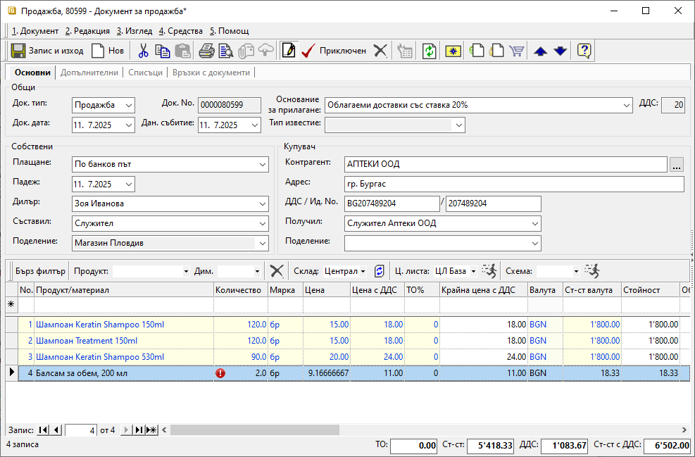
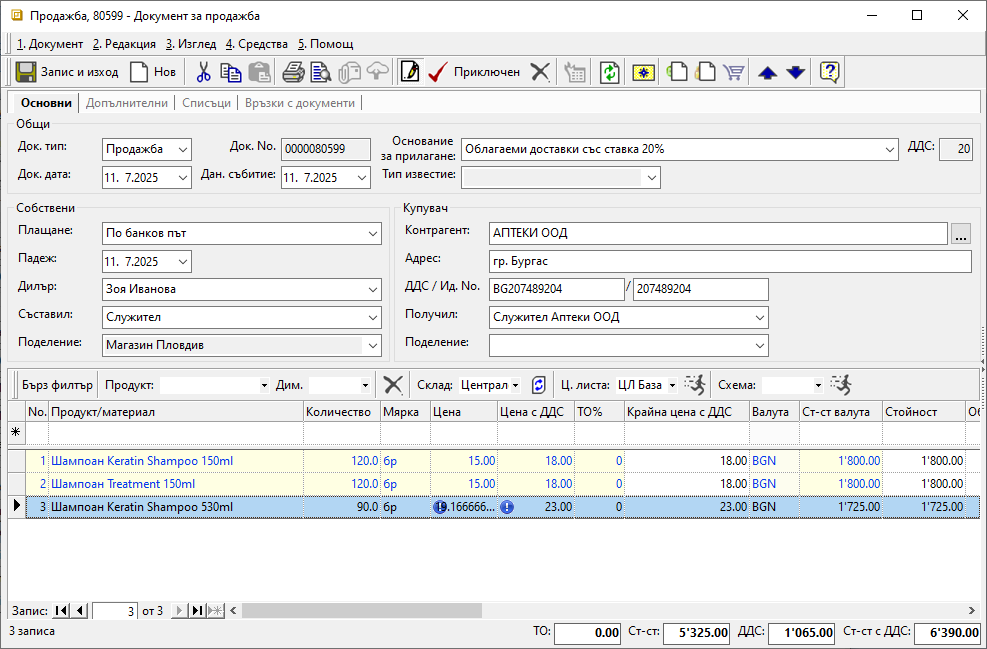
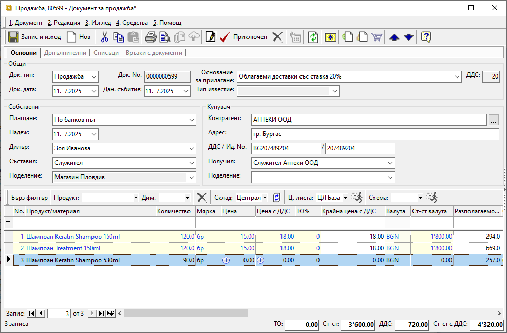
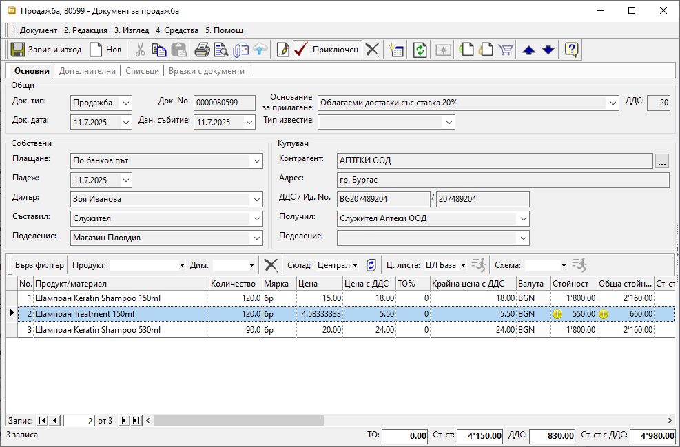

```{only} html
[Нагоре](000-index)
```

# Знаци в документите

В системата са заложени различни знаци, чиято цел е да привлекат вниманието към възможни пропуски или грешки. Те се намират в документите за заявки и продажби и са по-скоро информативни. Тези предупреждения сигнализират за евентуален проблем, без да спират по-нататъшната обработка на съответния документ.  

1. **Червен знак с удивителна** — Червеният знак се появява в колона **Количество**, когато посоченото количество надвишава разполагаемото. Това е предупреждение, че в избрания склад няма необходимата наличност от продукта. Следователно не е възможно приключване на разходен складов документ.

{ class=align-center w=15cm }

2. **Син знак с удивителна** — Синият знак се появява в колони **Цена** и **Цена с ДДС**. Той сигнализира, че въведената цена се различава от настройките на приложената ценова листа.  
Този знак не оказва влияние върху валидирането на документите.  

{ class=align-center w=15cm }

3. **Бял знак с удивителна** — Този знак се появява в колони **Цена** и **Цена с ДДС**, когато за даден продукт няма настроена цена в приложената Ценова листа.  
Този знак не влияе върху приключването на документите.  

{ class=align-center w=15cm }

4. **Жълт знак с удивителна** — Знакът се появява в колони **Стойност** и **Обща стойност с ДДС** когато цената в продажбата е по-ниска от средно претеглената цена в склада и има генериран складов документ.   

{ class=align-center w=15cm }
