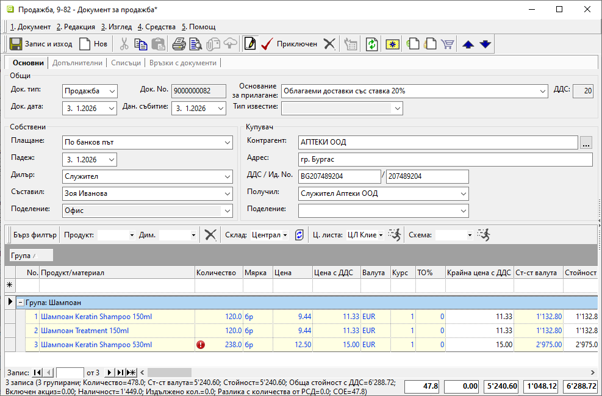
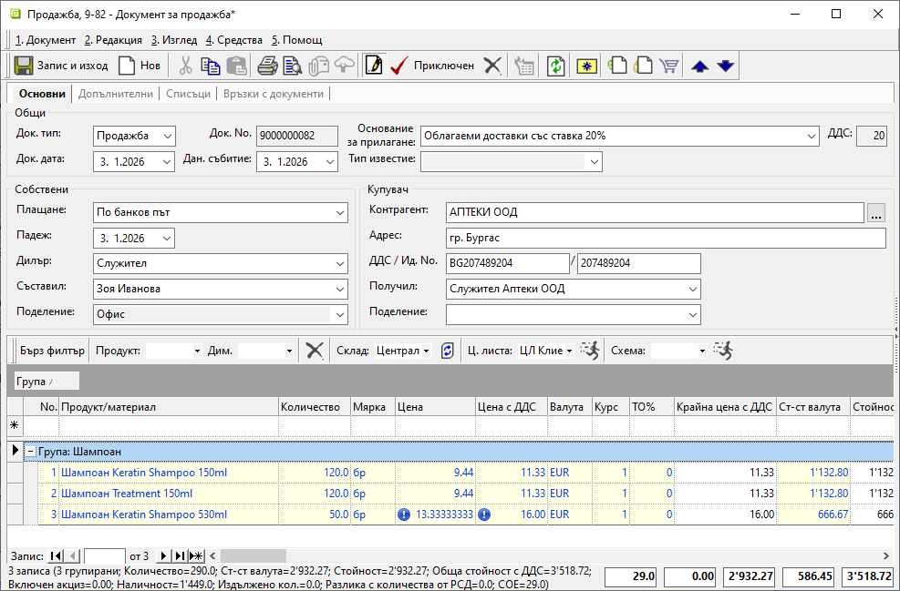
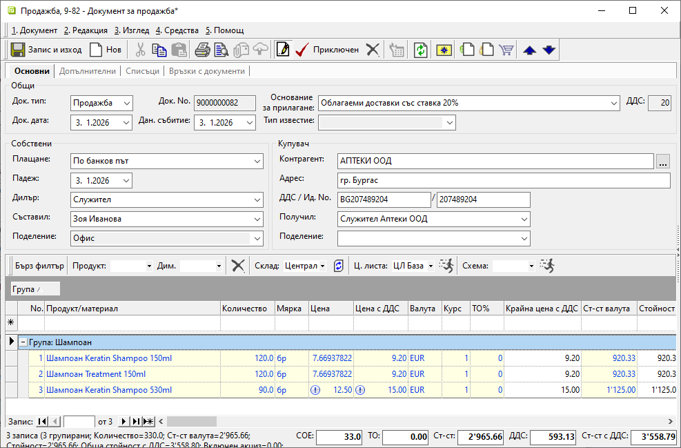
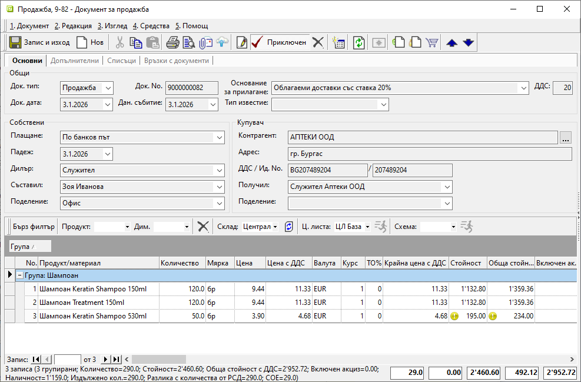

```{only} html
[Нагоре](000-index)
```

# **Знаци в документите**

В документите за заявка и продажба са заложени различни знаци. Те са по-скоро информативни с идеята да привлекат вниманието към възможни пропуски или грешки. Тези предупреждения сигнализират за евентуален проблем, без да спират по-нататъшната обработка на текущия документ.  

1) **Червен знак с удивителна** — Червеният знак се появява в колона **Количество**. Това е предупреждение, че въведената стойност надвишава разполагаемото количество за избрания в бързия филтър склад. Следователно не е възможно приключване на свързан разходен складов документ.  

{ class=align-center w=15cm }

2) **Син знак с удивителна** — Синият знак се появява в колони **Цена** и **Цена с ДДС**. Той сигнализира, че въведената цена се различава от настройките на приложената ценова листа.  
При този знак системата не ограничава валидирането на текущия или на свързаните документи.  

{ class=align-center w=15cm }

3) **Бял знак с удивителна** — Този знак се появява в колони **Цена** и **Цена с ДДС**. Показва, че продуктът няма настроена цена в приложената ценова листа.  
Не влияе върху приключването на документи.  

{ class=align-center w=15cm }

4) **Жълт знак с удивителна** — Знакът се появява в колони **Стойност** и **Обща стойност с ДДС**, когато има генериран свързан складов документ. Знакът предупреждава, че цената в продажбата е по-ниска от средно претеглената цена в склада.   

{ class=align-center w=15cm }
