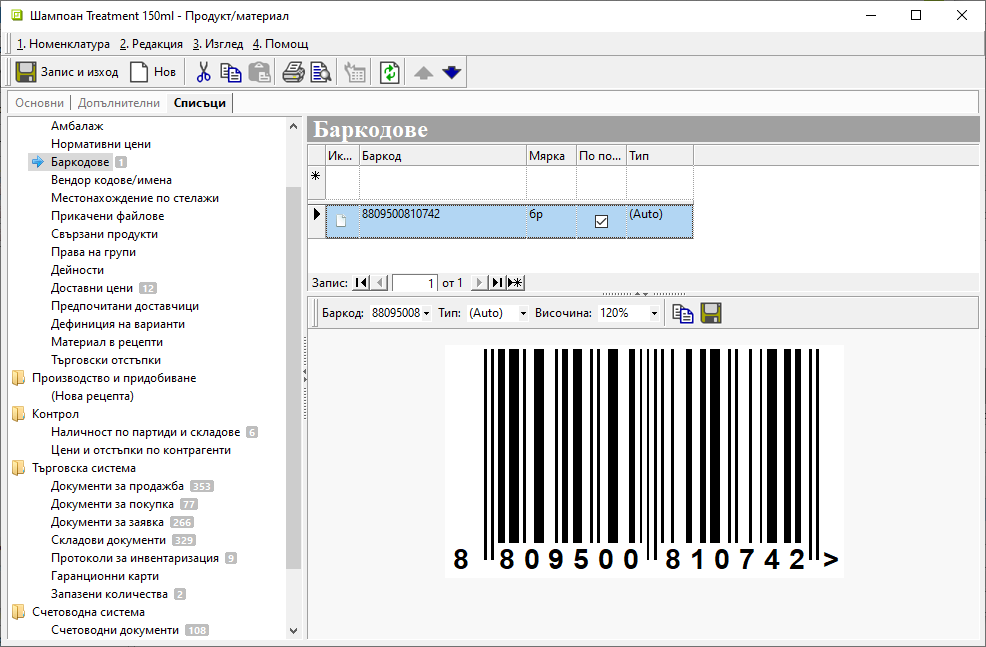
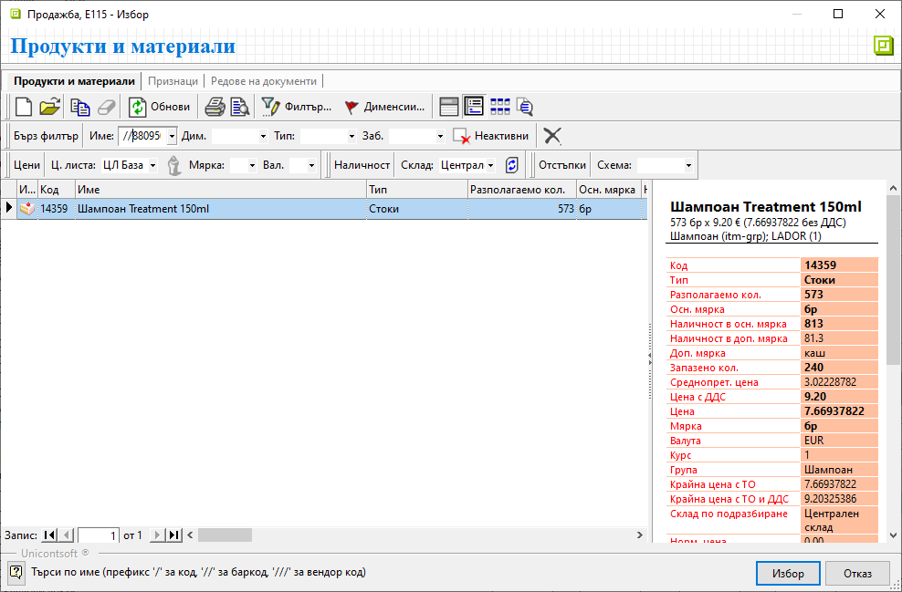
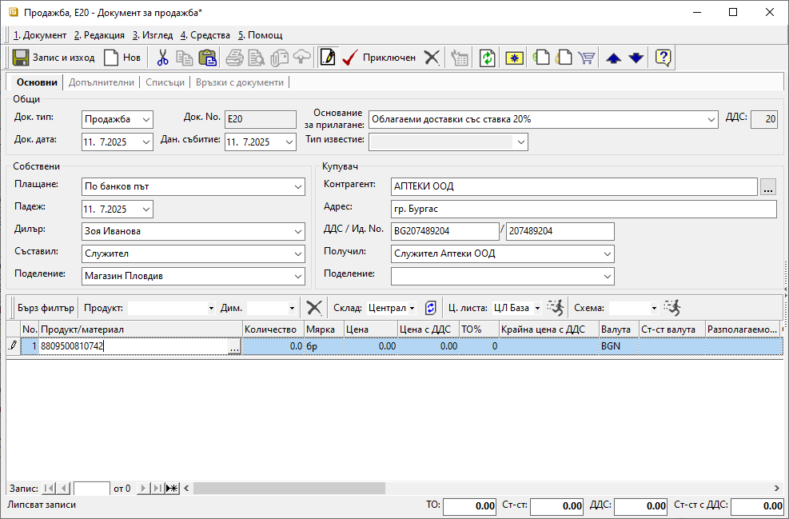
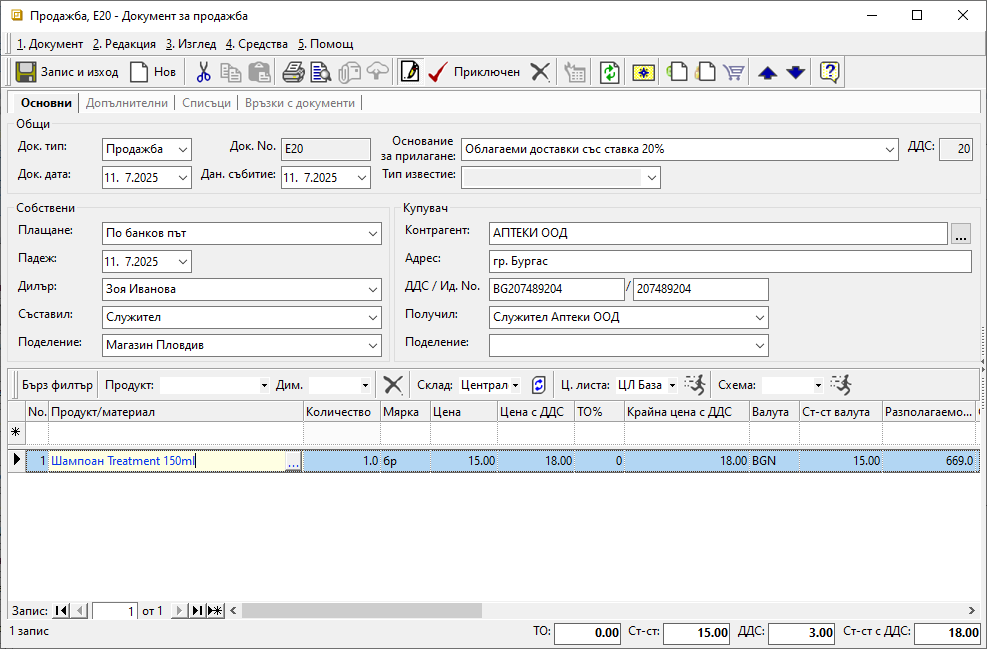

```{only} html
[Нагоре](000-index)
```

# **Работа с баркод скенер**

Използването на баркод скенер в системата изисква към машината да бъде настроено такова устройство.  

Необходимо е също въвеждането на баркодове, чрез които продуктите ще бъдат идентифицирани. Това може да се направи от форма за редакция на продукт в раздел **Списъци**.    

{ class=align-center w=15cm }

Баркодът се използва като критерий за търсене в полетата за въвеждане на продукт. Такива има в бързите филтри (поле **Име**), във филтър формите, в редове за добавяне на нов запис в документи, номенклатури и др.(поле **Продукт/материал**).   

{ class=align-center w=15cm }

За да се реализира търсене по баркод, курсорът се позиционира в полето за продукт. След това баркодът се маркира със скенера.  

{ class=align-center w=15cm }

При разпознаване на продукта системата попълва полето.  

> Когато няма пълно съвпадение на баркода, системата извежда форма за избор от списък **Продукт/Материал**.  
Същото важи и за случаите, когато няма настроен баркод за даден продукт.  

{ class=align-center w=15cm }
