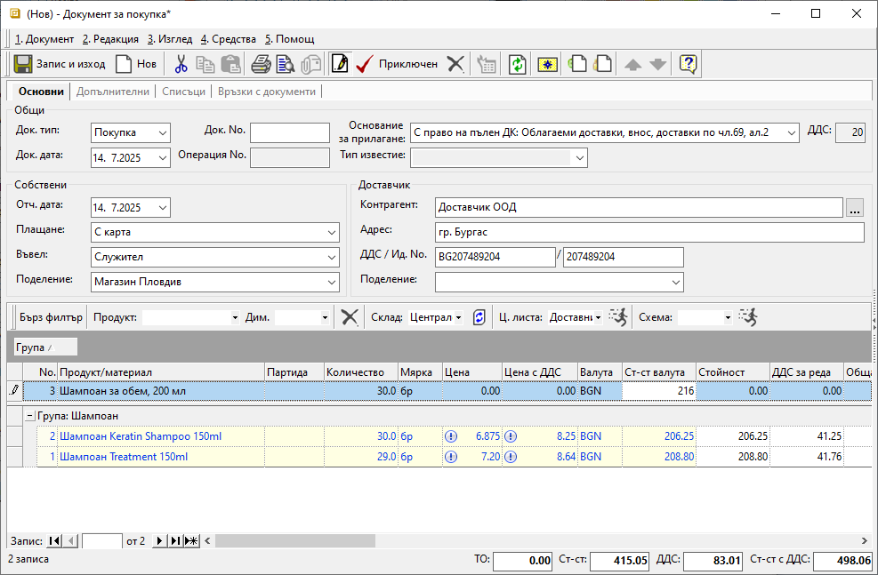

```{only} html
[Нагоре](000-index)
```

# Автоматично калкулиране на единична цена

В системата има вграден инструмент, който калкулира автоматично единична цена за продукта в документите за покупка и продажба.  

При покупки се използва често, когато въвеждането им е затруднено заради неподходящо закръгление на цените в получения документ. Чрез този вграден калкулатор всеки документ ще бъде коректно въведен в системата, независимо до кой знак е бил отпечатан от доставчика.   

Автоматичното калкулиране на единична цена се използва, като в поле **Ст-ст валута** на реда с избрания продукт се попълни общата стойност без ДДС. Спрямо въведеното количество системата изчислява единична цена за продукта.  

{ class=align-center w=15cm }

Ако колоната **Ст-ст валута** не се вижда в списъка, трябва да бъде показана през **Контекстно меню || Изглед на списък**.  
