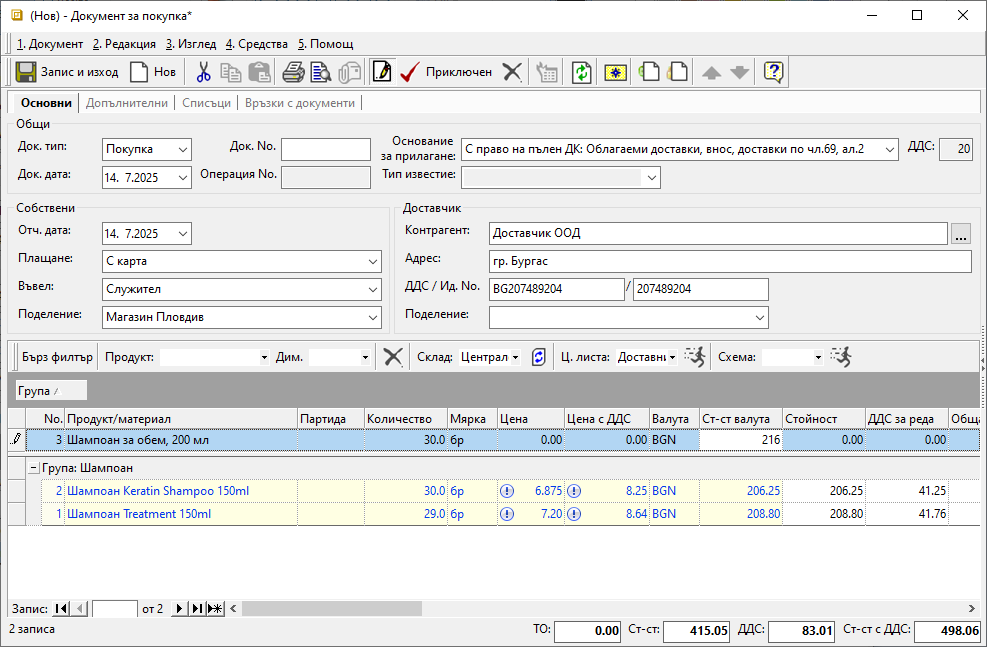

```{only} html
[Нагоре](000-index)
```

# Единична цена при покупка

В системата има вграден инструмент, който калкулира автоматично единична цена без ДДС в документите за покупка. Използва се, когато въвеждането на покупката е затруднено заради неподходящо закръгление на цените в получения документ.  

> Чрез този вграден калкулатор всеки документ за покупка ще бъде коректно въведен в системата, независимо до кой знак е бил отпечатан от доставчика.   

Използва се, като в поле **Ст-ст валута** се попълни общата стойност без ДДС за избрания на реда продукт/и. Спрямо въведеното количество системата изчислява единична цена без ДДС за продукта.  

{ class=align-center w=15cm }

Ако колоната **Ст-ст валута** не се вижда в списъка, трябва да бъде показана през **Контекстно меню || Изглед на списък**.  

