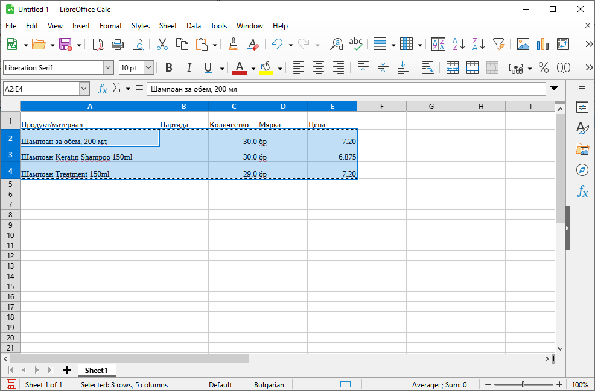
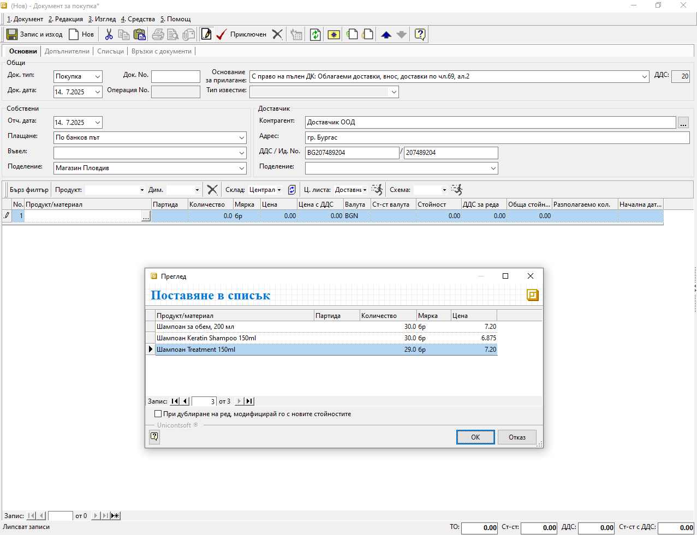
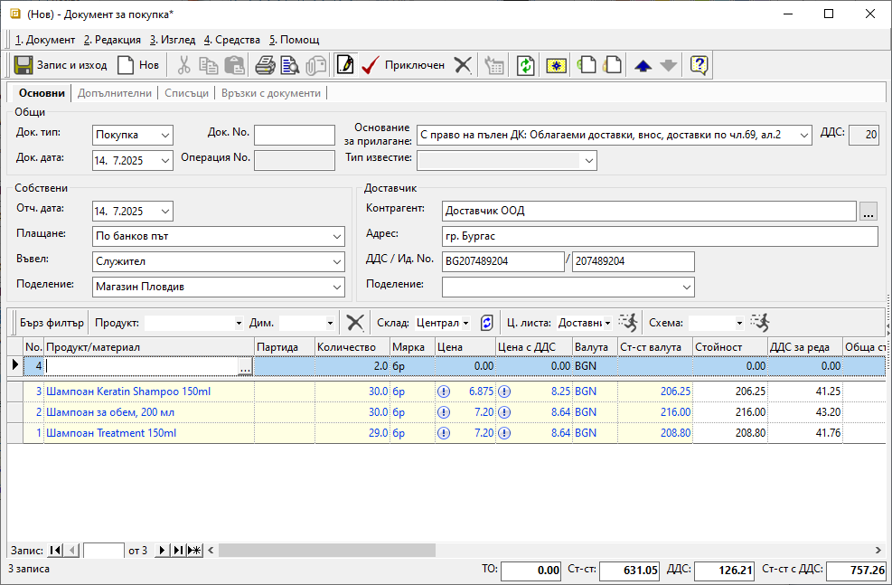

```{only} html
[Нагоре](000-index)
```

# Копиране на редове

В системата е реализирано копиране на списък с данни за продукти, както между документи в системата, така и от външен файл (напр. Excel). За да бъде приложено, системата трябва да идентифицира продуктите. Това означава продуктите да бъдат настроени идентично при източника и при получателя на данните (име, код, баркод).  

1) **Копиране от източника на данни** - За да бъдат успешно разпознати от системата, данните трябва да следват еднаква подредба. Колоните на списъка при източника на данни трябва да бъдат в същата последователност, както тези при получателя - напр. Продукт/материал, Партида, количество, мярка, цена.  
Желаните данни се копират с клавишна комбинация Ctrl+C или с десен бутон на мишката и опция *Копиране*.  

{ class=align-center w=15cm } 


2) **Поставяне при получателя на данни** - Поставянето на копираните данните става в поле **Продукт/материал** на реда за добавяне на нов запис. Използват се клавишната комбинация Ctrl+V или десен бутон на мишката - *Постави*.  
Системата извежда форма за преглед **Поставяне в списък**. Успешно идентифицираните данни могат да бъдат добавени в новия списък.  

{ class=align-center w=15cm } 

3) Чрез бутон [Ок] се потвърждава добавянето на данните в редовете на новия списък. Системата ще изведе информация по редовете с данни, които не успява да разпознае.  
При успешно копирани в новия списък данни, формата **Поставяне в списък** се затваря автоматично.  

{ class=align-center w=15cm } 