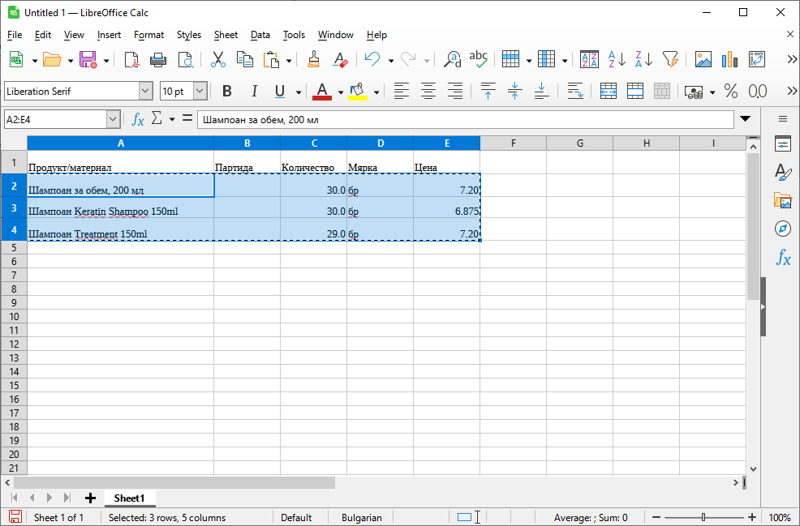
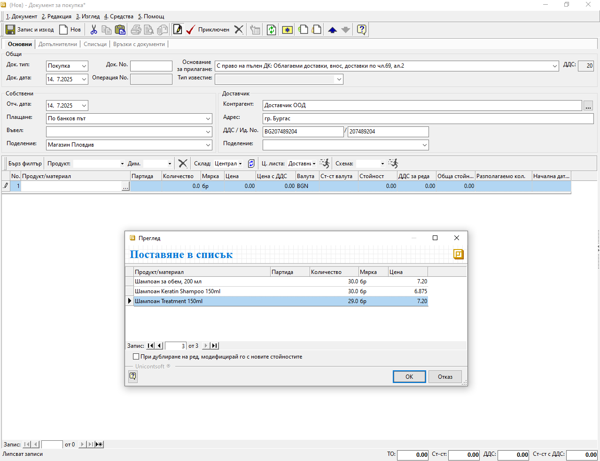
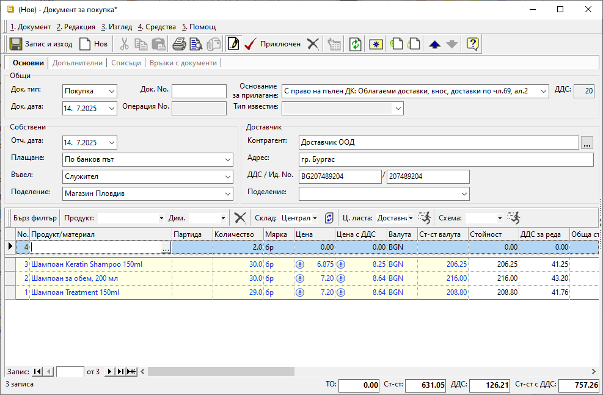

```{only} html
[Нагоре](000-index)
```

# **Копиране на списък**

В системата е реализирано копиране на списък с данни за продукти. Копирането работи както между документи в системата, така и от външен файл (напр. Excel).  

> За да се реализира копирането, системата трябва да идентифицира продуктите. Това изисква продуктите (име, код, баркод) да бъдат настроени идентично при източника и при получателя на данните.  

1) **Копиране на данните** - За да бъдат успешно разпознати от системата, данните трябва да следват еднаква подредба.  

   > Колоните в списъка-източник на данни трябва да бъдат в същата последователност, както тези в списъка-получател.  

   Маркирайте данните в списъка-източник. Копирайте с клавишна комбинация **Ctrl+C** или чрез десен клик и опция *Копиране*.  

{ class=align-center w=15cm } 


2) **Поставяне на данните** - Позиционирайте се в поле **Продукт/материал** на реда за добавяне на нов запис. Поставете копираните данните с клавишната комбинация **Ctrl+V** или с десен клик и *Постави*.  

   Системата стартира процес по идентифициране и извежда форма **Поставяне в списък**. Можете да добавите успешно разпознатите данните в редовете на документа с бутон [**Ок**].  

{ class=align-center w=15cm } 

Когато данните са успешно копирани, форма **Поставяне в списък** се затваря автоматично.   

{ class=align-center w=15cm } 
