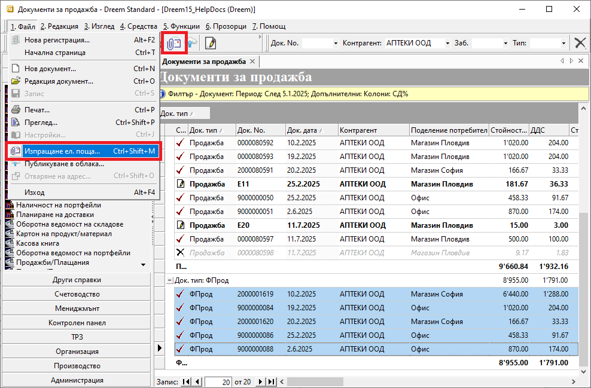
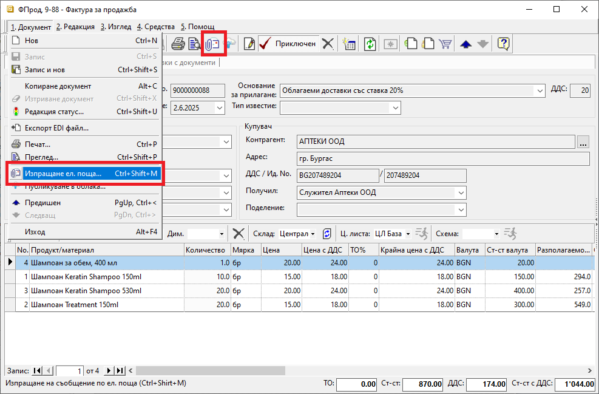
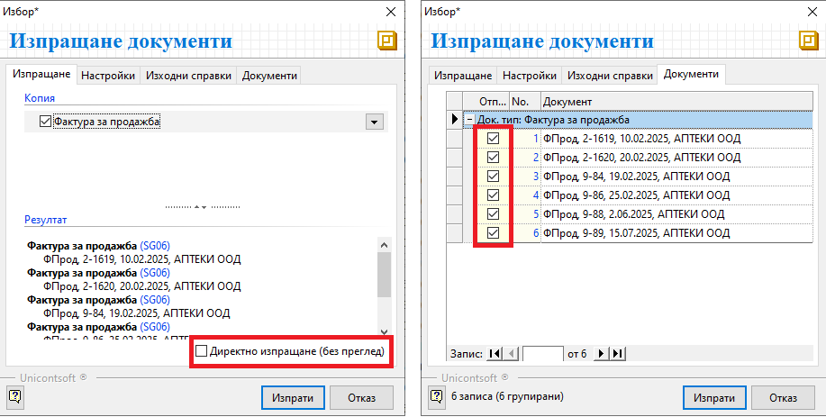
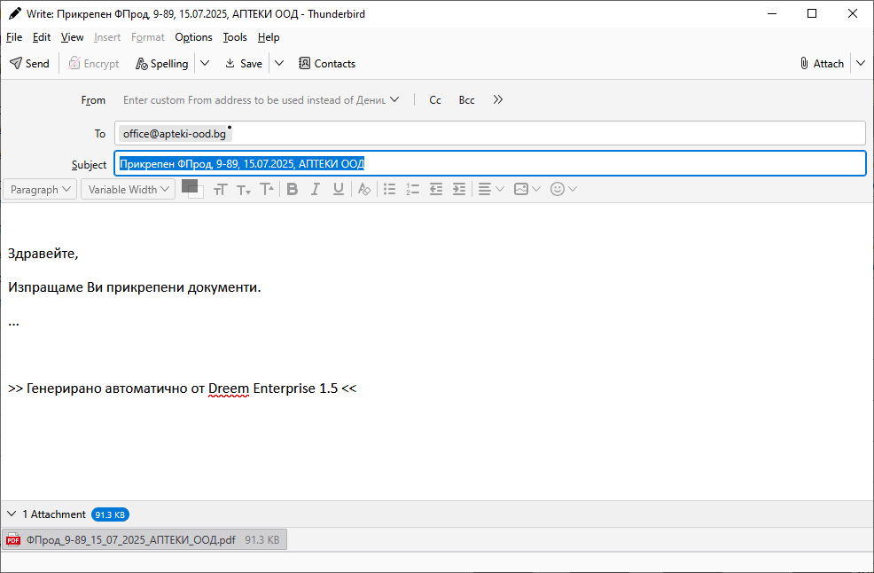

```{only} html
[Нагоре](000-index)
```

# **Изпращане на документ по имейл**

Системата дава възможност за бързо изпращане на документи по електронна поща. Тази опция е достъпна, когато потребителят има настроен е-mail клиент (напр. Outlook).  

1. **Настройки на Контрагент** — Настройка на ел. поща може да се направи от форма за редакция на контрагент. Това става от раздел **Реквизити: Други адреси** в поле **Ел. пощи**.  
Направените промени трябва да бъдат записани.  

{ class=align-center w=15cm }

2. **Изпращане на документи** — Един или няколко документа могат да бъдат изпратени от списък с документи. Избраните записи се маркират предварително и се избира опцията **Изпращане ел. поща**. Тя е достъпна от основното меню **1.Файл || Изпращане ел. поща**, от бутона в лентата с инструменти или чрез клавишна комбинация **Ctrl+Shift+M**.  

{ class=align-center w=15cm }

Друг вариант за изпращане е от форма за редакция на избрания документ.  
Опцията е достъпна от меню **1.Документ || Изпращане ел. поща**, от бутона в лентата с инструменти или чрез клавишна комбинация **Ctrl+Shift+M**.  

{ class=align-center w=15cm }

3. **Избор на документи** — На следваща стъпка системата отваря форма за избор **Изпращане документи**.  
Тук в секция **Изпращане** може да бъде отбелязано **Директно изпращане (без преглед)**. В този случай имейлът се изпраща без преглед.    
В секция **Документи** могат да бъдат потвърдени или отказани свързаните документи, подготвени за изпращане.  

{ class=align-center w=15cm }

4. **Изпращане** — Бутон **Изпрати** отваря форма за изпращане на съобщение, съдържащо избраните документи като прикачени файлове. Системата автоматично обзавежда текст на съобщението, който е настроено предварително.  
Текстът може да бъде редактиран или изтрит преди изпращане на документа.  

Ако е-mail на получателя не е предварително настроен през форма **Контрагент**, може да се въведе и в момента на изпращане през поле **To**.  

{ class=align-center w=15cm }

