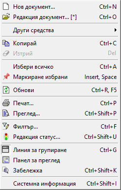

```{only} html
[Нагоре](000-index)
```

# **Клавишни комбинации**

В системата има действащи клавишни комбинации, изпълняващи различни операции. Всяка комбинация е посочена до съответната опция в менютата.    

{ class=align-center }

- **Alt+F2** (Нова регистрация) - Отваря форма *Установяване на самоличност* в контейнера. 	
- **Ctrl+T** (Начална страница) - Отваря *Начална страница* в контейнера.  
- **Ctrl+N** (Нов) - Отваря празна форма за въвеждане на нова номенклатура или нов документ. 	
- **Ctrl+O** (Отваряне) - Отваря форма за редакция на номенклатура или документ. 	
- **Ctrl+S** (Запис) 	Записва направените промени в документи. Записва филтрираните данни във файл. Използва се в справки.  
- **Ctrl+Shift+S** (Запис и нов) - Записва текущ и създава нов документ или нова номенклатура.  
- **Ctrl+Shift+U** (Редакция статус) - Променя текущия статус на документа (Изпратен, Получен и т.н.). 	 
- **Ctrl+P** (Печат) - Отваря форма *Печат* в документи и справки. 	
- **Ctrl+Shift+P** (Преглед) - Използва се за преглед на данни в избрана форма за печат в документи и справки. 	
- **Ctrl+J** (Настройки на печат) - Извежда форма за настройки на печатния формат в справки. 	
- **Ctrl+Shift+M** (Изпращане ел. поща) - Изпраща текущи данни като прикачен файл. Използва се в документи и справки. 	
- **Ctrl+Z** (Върни) - Връща към състояние преди последното действие. Използва се в номенклатури и документи. 	
- **Ctrl+X** (Изрежи) - Изрязва предварително маркирани данни. 	 
- **Ctrl+C** (Копирай) - Копира предварително маркирани данни. 	 
- **Ctrl+A** (Избери всичко) - Маркира всички записи в документи, списъци с документи и справки. 	
- **Alt+C** (Копиране документ/номенклатура) - Създава копие на текущ документ или на текуща номенклатура. 	 
- **Ctrl+V** (Постави) - Поставя предварително копирани данни. 	
- **Del** (Изтрий) - Изтрива предварително маркирани данни. 	
- **Ctrl+Shift+X** (Изтриване документ/номенклатура) - Изтрива унищожен документ или номенклатура. Използва се свободно при счетоводни документи. За номенклатури има услове да не са били използвани до момента в системата.  	
- **PageUp** или **Ctrl+<** (Предишен) - Преминаване към предишен запис в списък. 	
- **PageDown** или **Ctrl+>** (Следващ) - Преминаване към следващ запис в списък. 	 
- **Ctrl+F** (Търси) - Извежда форма *Търсене* в номенклатури и документи, съдържащи поле за коментар. 	
- **F3** (Следващо съвпадение) - Намира следващо съвпадение по зададен критерий. 	
- **F5** или **Ctrl+R** (Опресни) - Опреснява информацията в текущата форма. 	
- **Ctrl+Shift+G** (Графичен изглед) - Визуализира филтрираните данни в Графичен изглед. Използва се в справки. 	 
- **Ctrl+Shift+T** (Текстов изглед) - Визуализира филтрираните данни в Текстов изглед. Използва се в справки.   
- **Ctrl+Shift+D** (Списък с данни) - Визуализира филтрираните данни в списък. Използва се в справки. 	 
- **Ctrl+Shift+K** (Коментари) - Използва се в списъци с документи за визуализиране на поле Коментар за документите, съдържащи такъв. 	 
- **Ctrl+Shift+T** (Тотали) - Извежда тотали по зададена групировка в документи, списъци с документи и справки. 	
- **F7** (Лента с функции) - Извежда/ скрива *Лента с функции* в справки и списъци с номенклатури и документи. 	 
- **Ctrl+G** (Линия за групиране) - Извежда/ скрива *Линия за групиране* в справки и списъци с номенклатури и документи. 	
- **Ctrl+F11** (Пълен екран) - Използва се в контейнера за изглед в пълен екран. 	
- **Ctrl+E** (Редакция) - Променя състоянието на документа в *Редакция* (неактивна чернова за системата). 	 
- **Ctrl+Y** (Активен) - Променя състоянието на документа в *Активен* (валидиран). 	
- **Ctrl+Shift+Q** (Анулиран) - Променя състоянието на документа, като го отменя и унищожава. 	
- **Ctrl+F** (Филтър) - Извежда форма *Филтър* в номенклатури, списъци с документи и справки. 	 
- **Ctrl+D** (Генериране) - Извежда форма *Свързани документи* в приключени документи. 	 
- **Ctrl+Shift+I** (Системна информация) - Извежда информация за потребител и дата на създаване и модификация на избрания запис. Използва се в номенклатури и документи. 	
- **Alt+F5** (Промяна парола) - Отваря форма *Потребителска парола* в контейнера. 	 
- **Alt+P** (Настройки) - Извиква форма *Настройки* (Списъци, Контейнер, Контроли, Регионални и др.) в контейнера. 	
- **Ctrl+Q** (Малки /Големи икони) - Преминава от *Групиран изглед* в *Дървовиден изглед* в контейнера и обратното. 	
- **Ctrl+F6** (Следващ) - Преминава към следващ прозорец в контейнера. 	
- **Ctrl+Shift+F6** (Предишен) - Навигира до предходен прозорец в контейнера. 	
- **Ctrl+F4** или **Ctrl+W** (Затваряне прозорец) - Затваря текущ прозорец в контейнера. 	
- **Ctrl+W** или **Ctrl+Shift+W** (Затваряне форма) - Затваря текуща форма. 	
- **Ctrl+Shift+F4** (Затваряне всички) - Затваря всички активни прозорци в контейнера. 	
- **Alt+W** (Прозорци) - Отваря форма със списък прозорци в контейнера. 	
- **Ctrl+=** (Увеличава мащаб) - Увеличава мащаба. Използва се в справки. 	
- **Ctrl+-** (Намалява мащаб) - Намалява мащаба. Използва се в справки. 	
- **PageUp** (Предишна страница) - Навигира до предходна страница в справки. 	 
- **PageDown** (Следваща страница) - Преминава към следваща страница в справки. 	
- **Alt+Right** (Напред) - Използва се за придвижване напред в справки. 	
- **Backspace** или **Alt+Left** (Назад) - Използва се за придвижване назад в справки. 	
- **Shift+F1** (Съдържание) - Извиква помощна информация в контейнер. 	
- **Alt+F4** или **Ctrl+Shift+W** (Изход) - Използва се за изход от системата по всяко време. 	