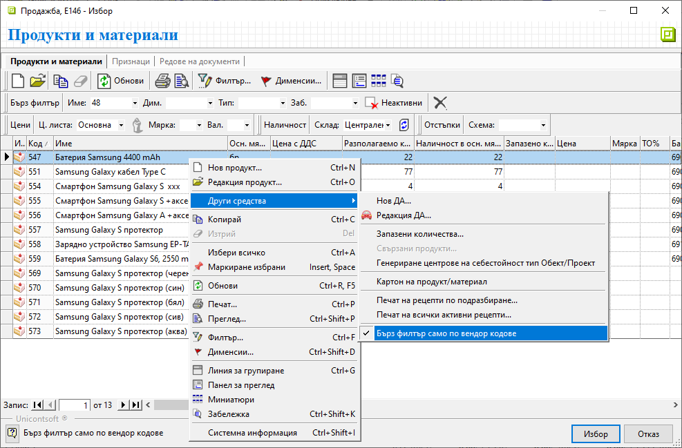

```{only} html
[Нагоре](000-index)
```

# **Търсене по вендор код**

За бързите филтри в системата може да бъде активирано търсене на продукти само по вендор код.   

Настройката е достъпна от списък **Продукти** чрез десен бутон на мишката и опция **Други средства » Бърз филтър само по вендор кодове**. Опцията може да бъде активирана/деактивирана по всяко време. Тя е отделна за всеки от списъците с продукти, според това в коя функционалност е отворен (**Номенклатури**, **Документи за продажба**, **Складови документи** и т.н.)   

{ class=align-center }

