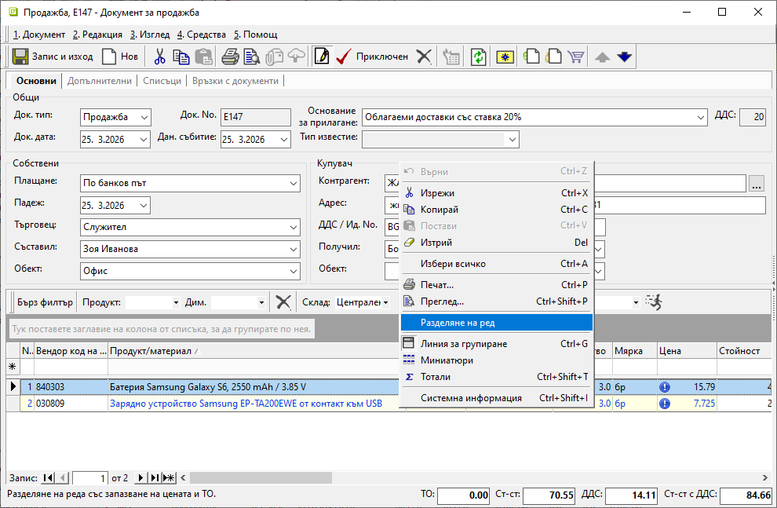
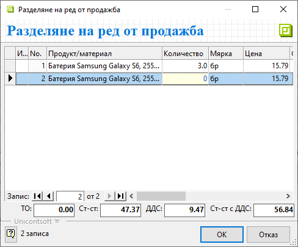
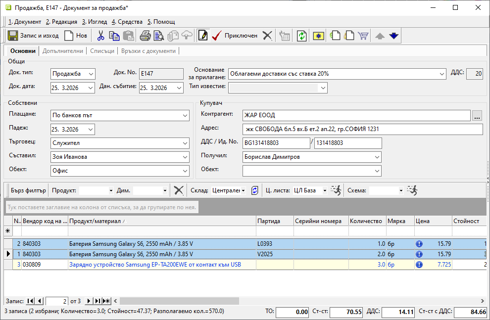

```{only} html
[Нагоре](000-index)
```

# **Разделяне на ред в продажба**

Системата разполага с инструмент за разделяне на вече въведен ред с продукт в документ за продажба.  
Когато за продукта има попълнено и общо количество, системата следи то да се запази при разделянето.  

Опцията е достъпна от форма за редакция на продажба. Маркира се избран продукт и с десен бутон се избира **Разделяне на ред**.  

{ class=align-center w=15cm }

Това отваря форма за разделяне. В нея има добавен нов ред с избрания продукт.  

От колона **Количество** на новия ред се попълва желаното. С него ще бъде намалено общо въведеното количество на оригиналния ред.  

{ class=align-center }

Промените се потвърждават с [**Enter**] и системата преизчислява количеството на оригиналния ред.  

{ class=align-center }

Направените модификации могат да бъдат отхвърлени с бутон [**Отказ**].  

За одобряване на корекциите се използва бутон [**OK**]. С това системата ги прилага в продажбата.  

{ class=align-center w=15cm }

Последващата обработка на документа продължава без особености.  
