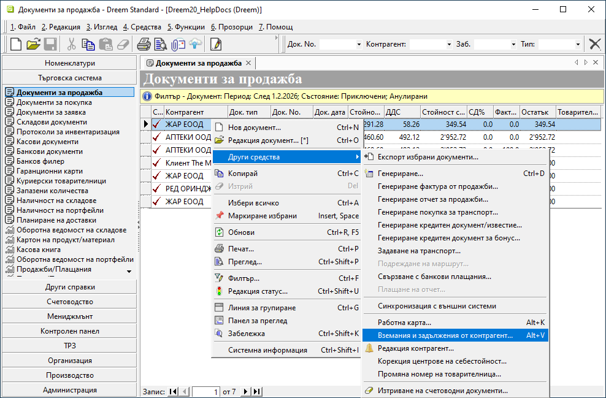
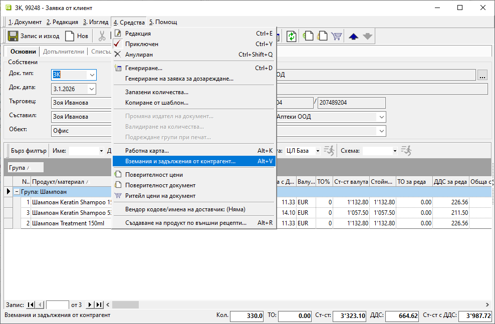

```{only} html
[Нагоре](000-index)
```

# **Бърза справка за контрагент**

В системата е достъпна кратка справка с вземания и задължения на контрагент. Тя може да бъде показана от документи за продажба, покупка и заявка.  

- **От списък с документи**  

Справката се визуализира чрез маркиране на документ за избрания контрагент. С десен бутон се отваря опцията **Други средства » Вземания и задължения от контрагент**.  


{ class=align-center w=15cm }

- **От форма за редакция на документ**  

В отворен документ на избрания контрагент справката е достъпна от меню **Средства » Вземания и задължения от контрагент**.  

{ class=align-center }

И в двата случая системата отваря формата **Информация за контрагент** с отделни колони за вземания и задължения. В нея са представени данни като неплатени остатъци по вътрешнофирмени и данъчни документи, каква част от тях са редовни и просрочени, дата и сума на последно плащане и други.   

{ class=align-center }
