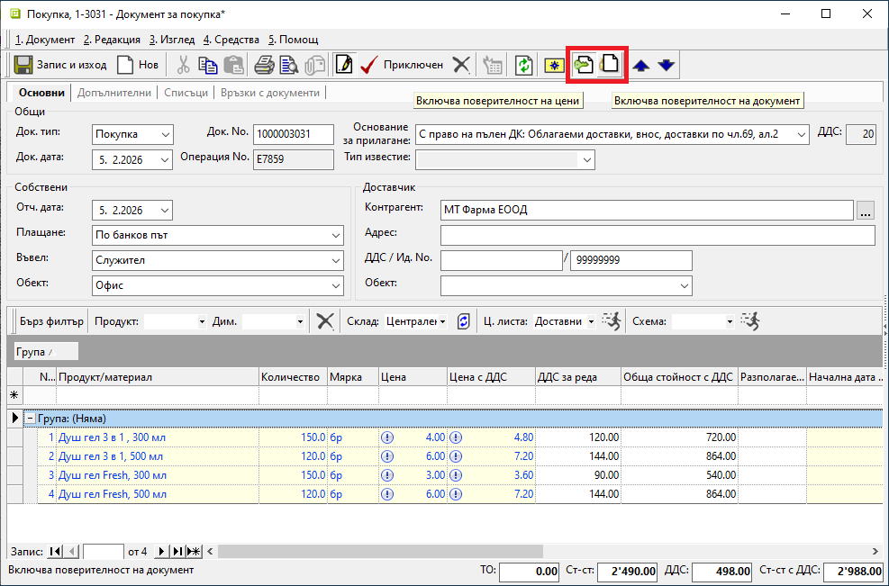

```{only} html
[Нагоре](000-index)
```

# **Поверителност в документи**

Системата дава възможност за селективно скриване на данни в избрани отделни документи. Може да бъде прилагано във всеки един от типовете документи.  
В последствие индикаторът за поверителност се използва при дефиниране на [**Права на групи**](../001-ref/004-settings/002-permissions.md).  

> Ограничаването на достъпа до данни се управлява от конкретния документ, докато е в състояние на редакция.  

Поверителност се активира/деактивира чрез бутони в лентата с инструменти:  

- **Включва поверителност на цени** - Служи като маркер за скриване на цените в избран документ. 
- **Включва поверителност на документ** - Служи като маркер за скриване на избран документ.  

{ class=align-center w=15cm }

> При генериране на свързани документи, те наследяват вече избраната поверителност.    

Поверителност за цени и/или за документи може да бъде дефинирана в продажба, покупка, заявка, протокол за инвентаризация, складов или счетоводен документ.  

В банков и касов документ може да бъде настроена единствено поверителност на документ.  

```{tip} 
Промяната на поверителност може да бъде забранена чрез настройка за права на групи. По същия начин е възможно автоматично активиране на поверителност при създаване на нов документ.  
```