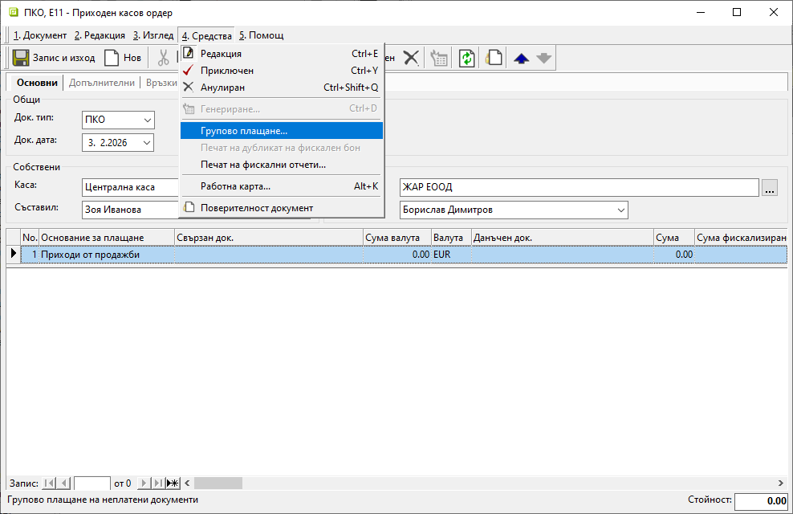
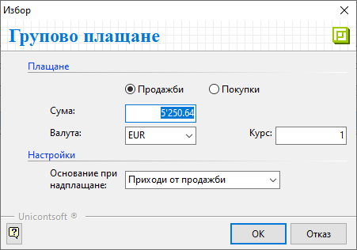
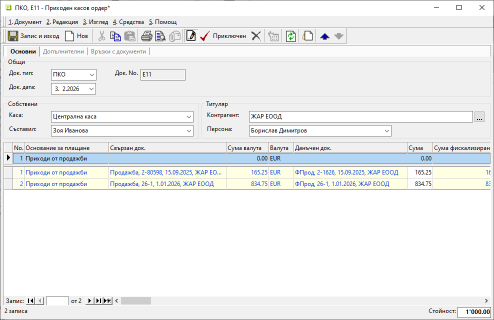

```{only} html
[Нагоре](000-index)
```

# **Групово плащане**

Системата разполага с инструмент за автоматично разплащане на множество покупки/продажби за избран контрагент. Опцията е достъпна от форма за редакция на касов документ в меню **Средства**.  

{ class=align-center w=15cm }

Това отваря форма за избор на детайли за плащането.  
Трябва да бъде маркирано дали за контрагента се разплащат продажби или покупки. Поле **Сума** показва тотал на остатъка за плащане към момента (**5250,64** евро). Може да се редактира със сумата на текущото плащане (**1000** евро).  
Избират се **Валута**, **Курс** и **Основание при надплащане**, които системата да попълни в касовия ордер.  

{ class=align-center }

При потвърждаване на избора полета **Свързан док.** и **Данъчен док.** в ордера се обзавеждат със свързани документи. Те са добавени по хронология от най-старите неплатени документи. 

{ class=align-center w=15cm }

> - При надплатена сума полета **Свързан док.** и **Данъчен док.** на реда остават празни.  
> - За последния документ се регистрира частично плащане, ако изплатената сума е по-малка от тотала на неплатените.  