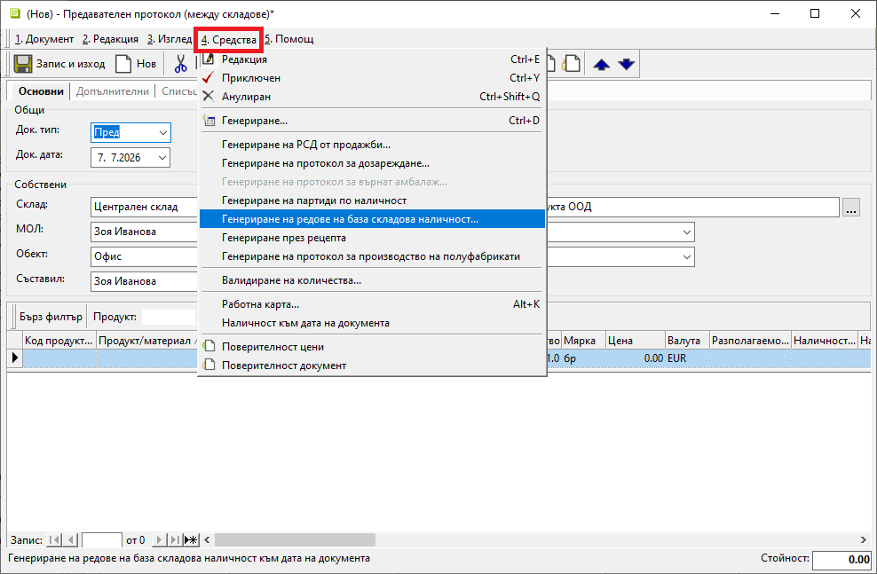
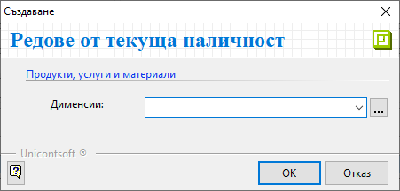
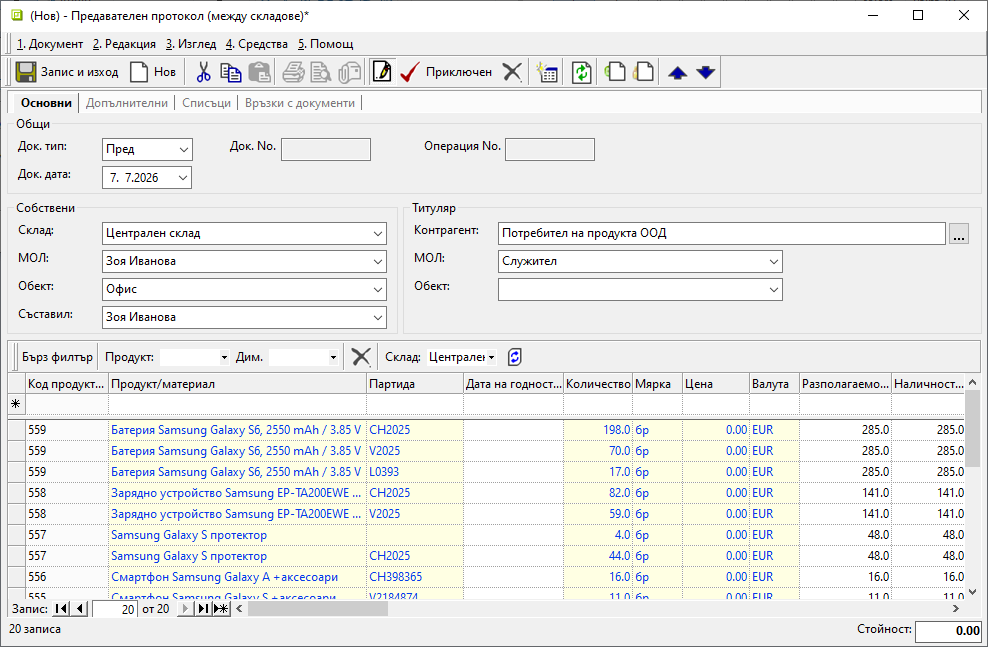

```{only} html
[Нагоре](000-index)
```

# **Генериране на редове с наличност**

В складови документи е достъпен инструмент за автоматичен импорт на списък с текущо налични продукти. Чрез него системата зарежда актуален списък с отделни категории или с всички продукти в наличност за избран склад.  
Генерацията може да бъде използвана в различни ситуации, например при трансфер на наличности между складове.  

Създайте нов складов документ. В него трябва да укажете **Склад**, за който да се генерират наличности. От меню **Средства** изберете функцията **Генериране на редове на база складова наличност**.

{ class=align-center w=15cm }

Това отваря форма **Редове от текуща наличност** с поле за избор от списък с **Дименсии**.  
Можете да избирате отделни категории продукти (една или няколко дименсии), които да бъдат включени в документа.  
Ако оставите полето празно, системата ще генерира списък с всички налични продукти.  

{ class=align-center }

При потвърждаване с бутон [**OK**] документът се обзавежда с продукти и наличности. Можете да редактирате списъка според нуждите на конкретната складова операция.  
Обработката на документа продължава без особености.  

{ class=align-center w=15cm }