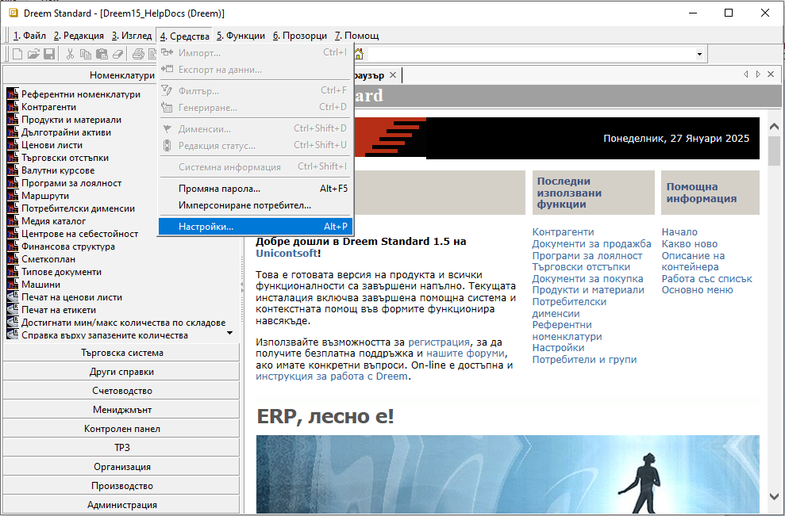
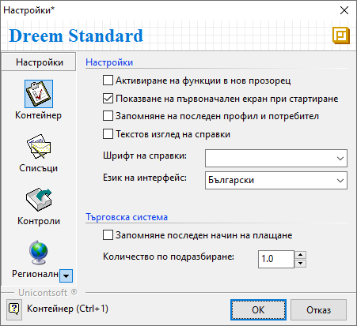
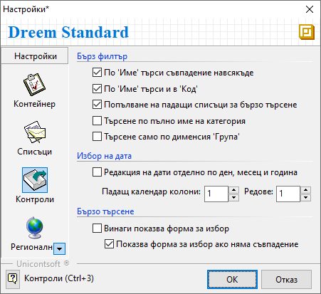
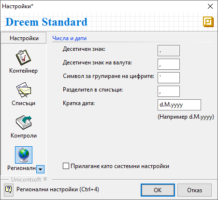

```{only} html
[Нагоре](000-index)
```

# Настройки

Общите настройки на Dreem ERP за текущо валидиран потребител се променят чрез меню **Средства || Настройки** в лентата с инструменти.

{ class=align-center }

В секция **Контейнер** са достъпни следните настройки:

 - **Активиране на функции в нов прозорец** – чрез поставяне/махане на отметка, може да бъде активирано/деактивирано автоматичното отваряне на всяка функция като отделен прозорец;  
 Активирането на тази опция позволява едновременно ползване на множество функции и по-бърза навигация между тях.  

 - **Показване на първоначален екран при стартиране** – с поставена/махната отметка се показва/скрива началният екран при стартиране на Dreem ERP;

 -  **Запомняне на последен профил и потребител** – опция, предлагаща последно влезлия потребител във форма **Установяване на самоличност** при следващо влизане в системата;

 - **Текстов изглед на справки** – чрез отметка в това поле може да се добави тип *Текстов изглед* за всички справки;  
 По подразбиране справките в системата имат два изгледа: *Графичен изглед* и *Списък с данни*.  

 - **Шрифт на справки** - поле за избор на шрифт, който да се използва при преглед/печат на справки;  

 - **Език на интерфейс** - поле за смяна на език на интерфейса;  

 - **Запомняне на последен начин на плащане** – при активиране на тази опция системата запомня и предлага последно използван начин на плащане във всеки следващ документ;  

 - **Количество по подразбиране** - поле за избор на стойност, която системата да предлага автоматично в колона **Количество** при добавяне на нов ред в документ;  

{ class=align-center }

В секция **Списъци** достъпните настройки са следните:

 - **Изглед** - настройката променя визуалния облик на интерфейса;  
 Опциите за избор са между три вида: Стандартен, Аквамарин и Пустинен. Системата предлага частична визуализация за всеки вид.

 - **Скриване на колона при групиране по нея** - сложете отметка тук, ако искате когато групирате някакъв изглед по дадена колона, тя автоматично да се скрива и изгледа не се претрупва излишно.  

 - **Скриване на празни филтри на списъци** - чрез поставяне/махане на отметка системата скрива/показва жълтата лента с основен филтър в списъки с номенклатури (*Продукти и материали*, *Контрагенти*, *Дълготрайни активи* и др.);    

 - **Форматиране на документи в редакция** - при активиране на настройката документите в състояние на редакция се визуализират с удебелен шрифт;    

{ class=align-center }

Секция **Контроли** предлага възможности за конфигуриране на филтрите при обработката на данни в системата.  

 - **По 'Име' търси съвпадение навсякъде** - настройката се активира/деактивира с поставяне/махане на отметка;  
 Когато опцията е активирана, системата търси по **Име** съвпадения във всички части на наименованието.  
 Когато настройката е неактивна, при търсене по **Име** в списък номенклатури (*Продукти и материали, *Контрагенти* и др.) системата търси съвпадение само на думи, започващи с тази буква, сричка или дума.  

 - **По 'Име' търси и в 'Код'** – когато настройката е активирана, системата търси съвпадения едновременно в наименованието и в кода на номенклатурата;  

 - **Попълване на падащи списъци за бързо търсене** - при поставяне/махане на отметка системата показва/скрива падащите списъци в бързите филтри;  

 - **Търсене по пълно име на категория** - при поставена отметка системата изисква да се изписва пълното наименование на категорията при търсене в *Дименсии*;  

 - **Търсене само по дименсия 'Група'** - когато настройката е активирана, системата предлага във филтрите само списък с основната група продукти;  
 Основна дименсия за групи продукти се настройва в **Администрация || Настройки || Продукти и материали: Дименсия за групи**.  

- **Редакция на дати отделно по ден, месец и година** - при активиране на настройката системата предлага автоматично маркиране на датата, разделяйки я на отделни части - ден, месец и година;  

 - **Винаги показва форма за избор** - когато настройката е активирана, системата винаги зарежда нов прозорец със списък при избор на номенклатура (*Продукти и материали*, *Контрагенти* и др.);

 - **Показва форма за избор ако няма съвпадение** - когато настройката е активирана, системата отваря нов прозорец със списък за избор на номенклатура (*Продукти и материали*, *Контрагенти* и др.), ако няма съвпадение при търсенето;  
 Настройката е достъпна, когато няма отметка в предходната опция.   

{ class=align-center }

В секция **Регионални настройки** могат да се дефинират формати на числа и дати.  
- **Десетеичен знак**, **Десетичен знак за валута** и **Символ за групиране на цифрите** - полета за избор на различен символ, определящ съответния числов формат;  
- **Разделител в списъци** - 
- **Кратка дата** - поле за избор на формат, по който се визуализира датата навсякъде в системата;  
- **Прилагане като системни настройки** - чрез отметка в полето гореизбраните числови формати се прилагат към текущите регионални настройки на Windows;  

{ class=align-center }

